# Ferramentas de Padronização de Código para SDD

## Introdução

**Padronização de código** é essencial em Spec-Driven Development para garantir que código gerado e escrito manualmente siga os mesmos padrões de qualidade, estilo e convenções. Este documento cobre ferramentas de **linting**, **formatting**, **type checking** e **code quality** que complementam o workflow SDD.

Este documento cobre:
- Linters (ESLint, Pylint, etc)
- Formatters (Prettier, Black, etc)
- Type checkers (TypeScript, mypy, etc)
- Code quality (SonarLint, etc)
- Integração com CI/CD e IDE
- Configurações recomendadas para SDD

---

## Por Que Padronização é Crítica para SDD?

### Problema: Código Gerado vs Código Manual

```typescript
// Código gerado por openapi-generator
export class UserService {
  public getUser(id:string):Promise<User>{
    return this.api.get(`/users/${id}`)
  }
}

// Código manual do desenvolvedor
export class AuthService {
  async login(email: string, password: string): Promise<Token> {
    return this.api.post('/auth/login', { email, password });
  }
}
```

**Problemas**:
- ❌ Estilos inconsistentes (espaçamento, tipos)
- ❌ Convenções diferentes
- ❌ Dificulta code review
- ❌ Aumenta dívida técnica

### Solução: Padronização Automática

```typescript
// Após linting + formatting
export class UserService {
  async getUser(id: string): Promise<User> {
    return this.api.get(`/users/${id}`);
  }
}

export class AuthService {
  async login(email: string, password: string): Promise<Token> {
    return this.api.post('/auth/login', { email, password });
  }
}
```

**Benefícios**:
- ✅ Estilo consistente
- ✅ Menos conflitos em PRs
- ✅ Foco em lógica, não em estilo
- ✅ Onboarding mais rápido

---

## Categorias de Ferramentas

```mermaid
graph LR
    Code["Código<br/>(Gerado + Manual)"] --> Linters["1. Linters<br/>ESLint, Pylint<br/>Detectam problemas"]
    Linters --> Formatters["2. Formatters<br/>Prettier, Black<br/>Corrigem estilo"]
    Formatters --> TypeCheck["3. Type Checkers<br/>TypeScript, mypy<br/>Validam tipos"]
    TypeCheck --> Quality["4. Code Quality<br/>SonarLint<br/>Analisam qualidade"]
    Quality --> PreCommit["5. Pre-commit Hooks<br/>Husky, pre-commit<br/>Aplicam antes do commit"]
    PreCommit --> CICD["6. CI/CD<br/>GitHub Actions<br/>Validam no pipeline"]
    CICD --> Deploy["Deploy"]
    
    style Code fill:#e3f2fd
    style Linters fill:#fff3e0
    style Formatters fill:#f3e5f5
    style TypeCheck fill:#e1f5ff
    style Quality fill:#fff3e0
    style PreCommit fill:#ffe0b2
    style CICD fill:#c8e6c9
    style Deploy fill:#e8f5e9
```



---

## 1. Linters

### ESLint (JavaScript/TypeScript)

**O que é**: Linter mais popular para JavaScript/TypeScript.

**Instalação**:
```bash
npm install --save-dev eslint @typescript-eslint/parser @typescript-eslint/eslint-plugin
```

**Configuração para SDD**:
```javascript
// .eslintrc.js
module.exports = {
  parser: '@typescript-eslint/parser',
  extends: [
    'eslint:recommended',
    'plugin:@typescript-eslint/recommended',
    'plugin:@typescript-eslint/recommended-requiring-type-checking',
  ],
  parserOptions: {
    project: './tsconfig.json',
    ecmaVersion: 2022,
    sourceType: 'module',
  },
  rules: {
    // Consistência com código gerado
    '@typescript-eslint/explicit-function-return-type': 'error',
    '@typescript-eslint/no-explicit-any': 'error',
    '@typescript-eslint/no-unused-vars': 'error',
    
    // Segurança
    'no-eval': 'error',
    'no-implied-eval': 'error',
    'no-new-func': 'error',
    
    // Boas práticas
    'prefer-const': 'error',
    'no-var': 'error',
    'eqeqeq': ['error', 'always'],
    
    // Async/await
    'require-await': 'error',
    'no-return-await': 'error',
    
    // Imports
    'sort-imports': ['error', {
      ignoreCase: true,
      ignoreDeclarationSort: true,
    }],
  },
  ignorePatterns: [
    'node_modules/',
    'dist/',
    'generated/',  // Código gerado por openapi-generator
    'coverage/',
  ],
};
```

**Uso**:
```bash
# Lint
npx eslint src/

# Lint com fix automático
npx eslint src/ --fix

# Lint arquivo específico
npx eslint src/services/user.service.ts
```

**Integração package.json**:
```json
{
  "scripts": {
    "lint": "eslint src/",
    "lint:fix": "eslint src/ --fix"
  }
}
```

---

### Pylint (Python)

**O que é**: Linter para Python com análise de qualidade de código.

**Instalação**:
```bash
pip install pylint
```

**Configuração para SDD**:
```ini
# .pylintrc
[MASTER]
ignore=generated,venv,.venv

[MESSAGES CONTROL]
disable=
    missing-docstring,
    too-few-public-methods

[FORMAT]
max-line-length=100
indent-string='    '

[BASIC]
good-names=i,j,k,ex,_,id,db

[DESIGN]
max-args=7
max-attributes=10
```

**Uso**:
```bash
pylint src/
pylint --rcfile=.pylintrc src/
```

---

### RuboCop (Ruby)

**O que é**: Linter e formatter para Ruby.

**Instalação**:
```bash
gem install rubocop
```

**Configuração**:
```yaml
# .rubocop.yml
AllCops:
  NewCops: enable
  Exclude:
    - 'generated/**/*'
    - 'vendor/**/*'

Style/StringLiterals:
  EnforcedStyle: single_quotes

Metrics/MethodLength:
  Max: 20
```

**Uso**:
```bash
rubocop
rubocop -a  # Auto-correct
```

---

### Golint / golangci-lint (Go)

**O que é**: Linter agregador para Go.

**Instalação**:
```bash
go install github.com/golangci/golangci-lint/cmd/golangci-lint@latest
```

**Configuração**:
```yaml
# .golangci.yml
linters:
  enable:
    - errcheck
    - gosimple
    - govet
    - ineffassign
    - staticcheck
    - unused
    - gofmt
    - goimports

linters-settings:
  gofmt:
    simplify: true
  
issues:
  exclude-dirs:
    - generated
```

**Uso**:
```bash
golangci-lint run
```

---

## 2. Formatters

### Prettier (JavaScript/TypeScript/JSON/YAML/Markdown)

**O que é**: Formatter opinativo que suporta múltiplas linguagens.

**Instalação**:
```bash
npm install --save-dev prettier
```

**Configuração para SDD**:
```json
// .prettierrc
{
  "semi": true,
  "trailingComma": "all",
  "singleQuote": true,
  "printWidth": 100,
  "tabWidth": 2,
  "useTabs": false,
  "arrowParens": "always",
  "endOfLine": "lf",
  "overrides": [
    {
      "files": "*.yaml",
      "options": {
        "tabWidth": 2
      }
    },
    {
      "files": "specs/*.yaml",
      "options": {
        "printWidth": 120
      }
    }
  ]
}
```

**Ignore**:
```
# .prettierignore
node_modules/
dist/
generated/
coverage/
*.min.js
package-lock.json
```

**Uso**:
```bash
# Format
npx prettier --write .

# Check
npx prettier --check .

# Format specs
npx prettier --write specs/
```

**Integração com ESLint**:
```bash
npm install --save-dev eslint-config-prettier eslint-plugin-prettier
```

```javascript
// .eslintrc.js
module.exports = {
  extends: [
    'eslint:recommended',
    'plugin:@typescript-eslint/recommended',
    'prettier',  // Desabilita regras conflitantes
  ],
  plugins: ['prettier'],
  rules: {
    'prettier/prettier': 'error',
  },
};
```

---

### Black (Python)

**O que é**: Formatter opinativo para Python.

**Instalação**:
```bash
pip install black
```

**Configuração**:
```toml
# pyproject.toml
[tool.black]
line-length = 100
target-version = ['py310']
include = '\.pyi?$'
exclude = '''
/(
    \.git
  | \.venv
  | generated
  | __pycache__
)/
'''
```

**Uso**:
```bash
black src/
black --check src/  # Apenas verificar
```

---

### gofmt / goimports (Go)

**O que é**: Formatter oficial do Go.

**Uso**:
```bash
# Format
gofmt -w .

# Format com imports
goimports -w .
```

---

### rustfmt (Rust)

**O que é**: Formatter oficial do Rust.

**Configuração**:
```toml
# rustfmt.toml
max_width = 100
hard_tabs = false
tab_spaces = 4
```

**Uso**:
```bash
cargo fmt
cargo fmt -- --check
```

---

## 3. Type Checkers

### TypeScript

**Configuração para SDD**:
```json
// tsconfig.json
{
  "compilerOptions": {
    "target": "ES2022",
    "module": "commonjs",
    "lib": ["ES2022"],
    "outDir": "./dist",
    "rootDir": "./src",
    
    // Strict mode (recomendado para SDD)
    "strict": true,
    "noImplicitAny": true,
    "strictNullChecks": true,
    "strictFunctionTypes": true,
    "strictBindCallApply": true,
    "strictPropertyInitialization": true,
    "noImplicitThis": true,
    "alwaysStrict": true,
    
    // Checks adicionais
    "noUnusedLocals": true,
    "noUnusedParameters": true,
    "noImplicitReturns": true,
    "noFallthroughCasesInSwitch": true,
    
    // Modules
    "esModuleInterop": true,
    "skipLibCheck": true,
    "forceConsistentCasingInFileNames": true,
    
    // Source maps
    "sourceMap": true,
    "declaration": true,
    "declarationMap": true
  },
  "include": ["src/**/*"],
  "exclude": ["node_modules", "dist", "generated"]
}
```

**Uso**:
```bash
tsc --noEmit  # Type check sem compilar
tsc           # Compilar
```

---

### mypy (Python)

**O que é**: Type checker para Python.

**Instalação**:
```bash
pip install mypy
```

**Configuração**:
```ini
# mypy.ini
[mypy]
python_version = 3.10
warn_return_any = True
warn_unused_configs = True
disallow_untyped_defs = True
disallow_incomplete_defs = True
check_untyped_defs = True
no_implicit_optional = True

[mypy-generated.*]
ignore_errors = True
```

**Uso**:
```bash
mypy src/
```

---

## 4. Code Quality

### SonarLint (IDE Integration)

**O que é**: Extensão IDE que detecta bugs e code smells em tempo real.

**Instalação VS Code**:
```bash
code --install-extension SonarSource.sonarlint-vscode
```

**Configuração**:
```json
// .vscode/settings.json
{
  "sonarlint.rules": {
    "typescript:S1481": {
      "level": "on"
    },
    "typescript:S3776": {
      "level": "on",
      "parameters": {
        "threshold": "15"
      }
    }
  },
  "sonarlint.connectedMode.project": {
    "projectKey": "my-sdd-project"
  }
}
```

---

### EditorConfig

**O que é**: Define estilos básicos de editor (indentação, line endings).

**Configuração**:
```ini
# .editorconfig
root = true

[*]
charset = utf-8
end_of_line = lf
insert_final_newline = true
trim_trailing_whitespace = true

[*.{js,ts,json,yaml,yml}]
indent_style = space
indent_size = 2

[*.{py,go}]
indent_style = space
indent_size = 4

[*.md]
trim_trailing_whitespace = false

[Makefile]
indent_style = tab
```

---

## 5. Pre-commit Hooks

### Husky + lint-staged (Node.js)

**Instalação**:
```bash
npm install --save-dev husky lint-staged
npx husky install
```

**Configuração**:
```json
// package.json
{
  "scripts": {
    "prepare": "husky install"
  },
  "lint-staged": {
    "*.{js,ts}": [
      "eslint --fix",
      "prettier --write"
    ],
    "*.{json,yaml,yml,md}": [
      "prettier --write"
    ],
    "specs/*.yaml": [
      "spectral lint",
      "prettier --write"
    ]
  }
}
```

**Criar hook**:
```bash
npx husky add .husky/pre-commit "npx lint-staged"
```

---

### pre-commit (Python)

**Instalação**:
```bash
pip install pre-commit
```

**Configuração**:
```yaml
# .pre-commit-config.yaml
repos:
  - repo: https://github.com/pre-commit/pre-commit-hooks
    rev: v4.4.0
    hooks:
      - id: trailing-whitespace
      - id: end-of-file-fixer
      - id: check-yaml
      - id: check-json
      - id: check-added-large-files
  
  - repo: https://github.com/psf/black
    rev: 23.3.0
    hooks:
      - id: black
  
  - repo: https://github.com/PyCQA/pylint
    rev: v3.0.0
    hooks:
      - id: pylint
  
  - repo: https://github.com/pre-commit/mirrors-mypy
    rev: v1.3.0
    hooks:
      - id: mypy
```

**Instalar hooks**:
```bash
pre-commit install
```

**Uso**:
```bash
# Roda automaticamente no commit
git commit -m "feat: add user service"

# Rodar manualmente
pre-commit run --all-files
```

---

## 6. CI/CD Integration

### GitHub Actions Workflow Completo

```yaml
# .github/workflows/code-quality.yml
name: Code Quality

on:
  push:
    branches: [main, develop]
  pull_request:
    branches: [main]

jobs:
  lint-and-format:
    runs-on: ubuntu-latest
    
    steps:
      - uses: actions/checkout@v3
      
      - name: Setup Node.js
        uses: actions/setup-node@v3
        with:
          node-version: '18'
          cache: 'npm'
      
      - name: Install dependencies
        run: npm ci
      
      # Prettier check
      - name: Check formatting
        run: npm run format:check
      
      # ESLint
      - name: Lint code
        run: npm run lint
      
      # TypeScript type check
      - name: Type check
        run: npm run type-check
      
      # Specs validation
      - name: Validate OpenAPI specs
        run: |
          npm install -g @stoplight/spectral-cli
          spectral lint specs/*.yaml
  
  code-quality:
    runs-on: ubuntu-latest
    needs: lint-and-format
    
    steps:
      - uses: actions/checkout@v3
        with:
          fetch-depth: 0
      
      - name: SonarCloud Scan
        uses: SonarSource/sonarcloud-github-action@master
        env:
          GITHUB_TOKEN: ${{ secrets.GITHUB_TOKEN }}
          SONAR_TOKEN: ${{ secrets.SONAR_TOKEN }}
```

---

## Configuração Completa para Projeto SDD

### Estrutura de Arquivos

```
/
├── .editorconfig           # Estilos básicos
├── .prettierrc             # Formatter config
├── .prettierignore         # Arquivos ignorados
├── .eslintrc.js            # Linter config
├── .eslintignore           # Arquivos ignorados
├── tsconfig.json           # TypeScript config
├── .spectral.yaml          # Spec linting
├── .husky/                 # Git hooks
│   └── pre-commit
├── .github/
│   └── workflows/
│       └── code-quality.yml
└── package.json
```

### package.json Scripts

```json
{
  "scripts": {
    "lint": "eslint src/",
    "lint:fix": "eslint src/ --fix",
    "format": "prettier --write .",
    "format:check": "prettier --check .",
    "type-check": "tsc --noEmit",
    "validate:specs": "spectral lint specs/*.yaml",
    "quality": "npm run lint && npm run format:check && npm run type-check && npm run validate:specs",
    "prepare": "husky install"
  }
}
```

---

## Boas Práticas

### 1. Consistência Entre Código Gerado e Manual

```typescript
// ✅ Bom: Configurar generator para seguir padrões
// openapi-generator-config.json
{
  "npmName": "my-api-client",
  "npmVersion": "1.0.0",
  "supportsES6": true,
  "withInterfaces": true,
  "useSingleRequestParameter": true,
  "enumPropertyNaming": "UPPERCASE"
}
```

### 2. Ignorar Código Gerado em Linters

```javascript
// .eslintrc.js
module.exports = {
  ignorePatterns: [
    'generated/',
    'dist/',
    'node_modules/',
  ],
};
```

### 3. Validar Specs Antes de Gerar Código

```bash
# Script de geração seguro
#!/bin/bash

# 1. Validar spec
spectral lint specs/api.yaml || exit 1

# 2. Gerar código
openapi-generator-cli generate -i specs/api.yaml -g typescript-node

# 3. Lint código gerado (apenas avisos)
eslint generated/ --max-warnings 10

# 4. Format código gerado
prettier --write generated/
```

### 4. Configurar IDE

```json
// .vscode/settings.json
{
  "editor.formatOnSave": true,
  "editor.codeActionsOnSave": {
    "source.fixAll.eslint": true,
    "source.organizeImports": true
  },
  "eslint.validate": [
    "javascript",
    "javascriptreact",
    "typescript",
    "typescriptreact"
  ],
  "prettier.requireConfig": true,
  "editor.defaultFormatter": "esbenp.prettier-vscode",
  "[yaml]": {
    "editor.defaultFormatter": "esbenp.prettier-vscode"
  },
  "[typescript]": {
    "editor.defaultFormatter": "esbenp.prettier-vscode"
  }
}
```

### 5. Extensões VS Code Recomendadas

```json
// .vscode/extensions.json
{
  "recommendations": [
    "dbaeumer.vscode-eslint",
    "esbenp.prettier-vscode",
    "editorconfig.editorconfig",
    "sonarsource.sonarlint-vscode",
    "streetsidesoftware.code-spell-checker",
    "ms-vscode.vscode-typescript-next"
  ]
}
```

---

## Comparação de Ferramentas

| Categoria | Ferramenta | Linguagens | Auto-fix | Preço |
|-----------|-----------|------------|----------|-------|
| **Linter** | ESLint | JS/TS | ✅ | Gratuito |
| **Linter** | Pylint | Python | ❌ | Gratuito |
| **Linter** | RuboCop | Ruby | ✅ | Gratuito |
| **Linter** | golangci-lint | Go | ✅ | Gratuito |
| **Formatter** | Prettier | Multi | ✅ | Gratuito |
| **Formatter** | Black | Python | ✅ | Gratuito |
| **Formatter** | gofmt | Go | ✅ | Gratuito |
| **Type Check** | TypeScript | TS | ❌ | Gratuito |
| **Type Check** | mypy | Python | ❌ | Gratuito |
| **Quality** | SonarLint | Multi | ❌ | Gratuito |

---

## Workflow Completo SDD + Padronização

```
1. Criar/Atualizar Spec
   ↓
2. Validar Spec (Spectral)
   ↓
3. Gerar Código (openapi-generator)
   ↓
4. Format Código Gerado (Prettier)
   ↓
5. Escrever Código Manual
   ↓
6. Pre-commit Hook
   ├── Lint (ESLint)
   ├── Format (Prettier)
   ├── Type Check (TypeScript)
   └── Validate Specs (Spectral)
   ↓
7. Push → CI/CD
   ├── Lint
   ├── Format Check
   ├── Type Check
   ├── Code Quality (SonarCloud)
   └── SAST (Semgrep, Snyk)
   ↓
8. Deploy
```

---

## Checklist de Padronização

### Setup Inicial
- [ ] Configurar EditorConfig
- [ ] Configurar Prettier
- [ ] Configurar ESLint (ou linter da linguagem)
- [ ] Configurar TypeScript (ou type checker)
- [ ] Configurar Spectral para specs
- [ ] Configurar pre-commit hooks
- [ ] Configurar CI/CD
- [ ] Documentar padrões no README

### Durante Desenvolvimento
- [ ] Rodar linter antes de commit
- [ ] Rodar formatter antes de commit
- [ ] Validar specs antes de gerar código
- [ ] Format código gerado
- [ ] Revisar avisos do linter

### Code Review
- [ ] CI/CD passou?
- [ ] Sem avisos de linter?
- [ ] Código formatado?
- [ ] Specs validadas?
- [ ] Tipos corretos?

---

## Recursos Adicionais

### Documentação Oficial
- **[ESLint](https://eslint.org/)**: Docs completos
- **[Prettier](https://prettier.io/)**: Guia de configuração
- **[TypeScript](https://www.typescriptlang.org/)**: Handbook
- **[Black](https://black.readthedocs.io/)**: Docs Python
- **[EditorConfig](https://editorconfig.org/)**: Especificação

### Guias de Estilo
- **[Airbnb JavaScript Style Guide](https://github.com/airbnb/javascript)**: Padrões JS
- **[Google Style Guides](https://google.github.io/styleguide/)**: Multi-linguagem
- **[PEP 8](https://peps.python.org/pep-0008/)**: Python style guide

---

## Conclusão

**Padronização de código é fundamental para SDD**:

1. **Linters**: Detectam problemas (ESLint, Pylint)
2. **Formatters**: Corrigem estilo (Prettier, Black)
3. **Type Checkers**: Validam tipos (TypeScript, mypy)
4. **Pre-commit Hooks**: Aplicam antes do commit
5. **CI/CD**: Validam no pipeline

**Benefícios**:
- ✅ Código consistente (gerado + manual)
- ✅ Menos conflitos em PRs
- ✅ Foco em lógica, não em estilo
- ✅ Onboarding mais rápido
- ✅ Qualidade de código maior

**Lembre-se**: Padronização não é sobre preferências pessoais, é sobre **consistência** e **produtividade** do time.
