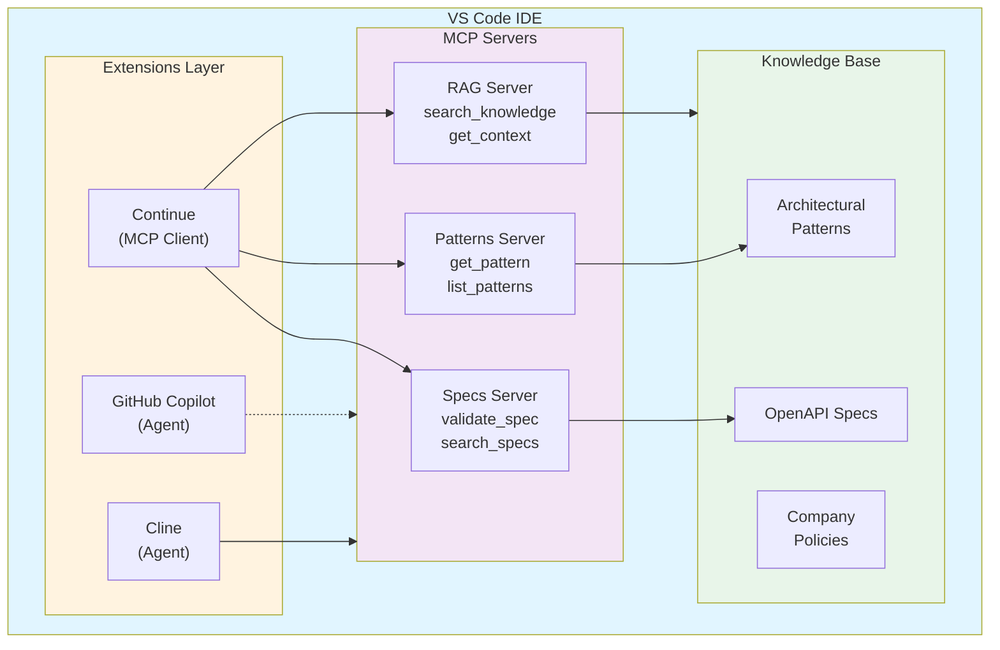

# Integrando RAG, MCP e Agents ao VS Code para SDD

## Introdução

Este guia mostra como configurar **VS Code** para trabalhar com **RAG**, **MCP** e **Agents** no contexto de Spec-Driven Development, transformando seu editor em um ambiente poderoso de desenvolvimento assistido por IA.

> **Pré-requisito**: Leia [RAG, MCP e Agents](rag-mcp-agents.md) para entender os conceitos fundamentais.

---

## Visão Geral da Arquitetura



---

## Parte 1: Configurando MCP no VS Code

### Opção 1: Continue.dev (Recomendado para MCP)

**Continue** é uma extensão VS Code que suporta nativamente MCP.

#### 1.1. Instalar Continue

```bash
# Via VS Code Marketplace
code --install-extension continue.continue
```

Ou busque por "Continue" no marketplace do VS Code.

#### 1.2. Criar Servidor MCP para Specs

```typescript
// mcp-server-specs/index.ts
import { Server } from "@modelcontextprotocol/sdk/server/index.js";
import { StdioServerTransport } from "@modelcontextprotocol/sdk/server/stdio.js";
import { z } from "zod";
import fs from "fs/promises";
import path from "path";
import yaml from "yaml";

const server = new Server(
  {
    name: "sdd-specs-server",
    version: "1.0.0",
  },
  {
    capabilities: {
      resources: {},
      tools: {},
    },
  }
);

// Diretório de specs
const SPECS_DIR = path.join(process.cwd(), "specs");

// Listar specs disponíveis
server.setRequestHandler("resources/list", async () => {
  const files = await fs.readdir(SPECS_DIR);
  const yamlFiles = files.filter(f => f.endsWith('.yaml') || f.endsWith('.yml'));
  
  return {
    resources: yamlFiles.map(file => ({
      uri: `spec:///${file}`,
      name: file.replace(/\.(yaml|yml)$/, ''),
      mimeType: "application/yaml",
      description: `OpenAPI specification: ${file}`
    }))
  };
});

// Ler conteúdo de spec
server.setRequestHandler("resources/read", async (request) => {
  const uri = request.params.uri as string;
  const filename = uri.replace('spec:///', '');
  const filepath = path.join(SPECS_DIR, filename);
  
  try {
    const content = await fs.readFile(filepath, 'utf-8');
    return {
      contents: [{
        uri,
        mimeType: "application/yaml",
        text: content
      }]
    };
  } catch (error) {
    throw new Error(`Failed to read spec: ${filename}`);
  }
});

// Ferramentas para trabalhar com specs
server.setRequestHandler("tools/list", async () => {
  return {
    tools: [
      {
        name: "validate_spec",
        description: "Valida especificação OpenAPI 3.0",
        inputSchema: {
          type: "object",
          properties: {
            spec: {
              type: "string",
              description: "Conteúdo YAML da especificação"
            }
          },
          required: ["spec"]
        }
      },
      {
        name: "search_specs",
        description: "Busca specs por palavra-chave",
        inputSchema: {
          type: "object",
          properties: {
            query: {
              type: "string",
              description: "Termo de busca"
            }
          },
          required: ["query"]
        }
      },
      {
        name: "generate_spec_template",
        description: "Gera template de spec OpenAPI",
        inputSchema: {
          type: "object",
          properties: {
            title: {
              type: "string",
              description: "Título da API"
            },
            description: {
              type: "string",
              description: "Descrição da API"
            }
          },
          required: ["title"]
        }
      }
    ]
  };
});

// Implementar ferramentas
server.setRequestHandler("tools/call", async (request) => {
  const { name, arguments: args } = request.params;
  
  switch (name) {
    case "validate_spec": {
      const SwaggerParser = (await import('@apidevtools/swagger-parser')).default;
      try {
        const spec = yaml.parse(args.spec);
        await SwaggerParser.validate(spec);
        return {
          content: [{
            type: "text",
            text: "✅ Spec válida!"
          }]
        };
      } catch (error: any) {
        return {
          content: [{
            type: "text",
            text: `❌ Erros de validação:\n${error.message}`
          }]
        };
      }
    }
    
    case "search_specs": {
      const files = await fs.readdir(SPECS_DIR);
      const results = [];
      
      for (const file of files) {
        if (!file.endsWith('.yaml') && !file.endsWith('.yml')) continue;
        
        const content = await fs.readFile(path.join(SPECS_DIR, file), 'utf-8');
        if (content.toLowerCase().includes(args.query.toLowerCase())) {
          results.push(file);
        }
      }
      
      return {
        content: [{
          type: "text",
          text: results.length > 0 
            ? `Specs encontradas:\n${results.join('\n')}`
            : "Nenhuma spec encontrada"
        }]
      };
    }
    
    case "generate_spec_template": {
      const template = {
        openapi: "3.0.0",
        info: {
          title: args.title,
          description: args.description || "",
          version: "1.0.0"
        },
        servers: [
          {
            url: "http://localhost:3000",
            description: "Development server"
          }
        ],
        paths: {},
        components: {
          schemas: {},
          securitySchemes: {}
        }
      };
      
      return {
        content: [{
          type: "text",
          text: yaml.stringify(template)
        }]
      };
    }
    
    default:
      throw new Error(`Unknown tool: ${name}`);
  }
});

// Iniciar servidor
const transport = new StdioServerTransport();
await server.connect(transport);
```

#### 1.3. Configurar Continue para Usar MCP

Crie `.continue/config.json` no seu projeto:

```json
{
  "models": [
    {
      "title": "GPT-4",
      "provider": "openai",
      "model": "gpt-4",
      "apiKey": "YOUR_OPENAI_API_KEY"
    }
  ],
  "mcpServers": {
    "specs": {
      "command": "node",
      "args": ["./mcp-server-specs/index.js"],
      "env": {}
    }
  },
  "contextProviders": [
    {
      "name": "code",
      "params": {}
    },
    {
      "name": "diff",
      "params": {}
    },
    {
      "name": "terminal",
      "params": {}
    }
  ]
}
```

#### 1.4. Usar MCP no Continue

No chat do Continue, você pode agora:

```
Você: Liste as specs disponíveis

Continue usa MCP tool "resources/list" automaticamente

Você: Valide a spec specs/auth.yaml

Continue usa MCP tool "validate_spec" automaticamente

Você: Crie uma nova spec para API de pagamentos

Continue usa MCP tool "generate_spec_template" + contexto
```

---

## Parte 2: Configurando RAG no VS Code

### Opção 1: RAG com Continue + ChromaDB

#### 2.1. Criar Servidor MCP com RAG

```typescript
// mcp-server-rag/index.ts
import { Server } from "@modelcontextprotocol/sdk/server/index.js";
import { StdioServerTransport } from "@modelcontextprotocol/sdk/server/stdio.js";
import { ChromaClient, OpenAIEmbeddingFunction } from "chromadb";
import OpenAI from "openai";

const openai = new OpenAI({ apiKey: process.env.OPENAI_API_KEY });
const chromaClient = new ChromaClient();

const embedder = new OpenAIEmbeddingFunction({
  openai_api_key: process.env.OPENAI_API_KEY!,
  model_name: "text-embedding-3-small"
});

// Criar/obter collection
let collection: any;

async function initializeCollection() {
  try {
    collection = await chromaClient.getCollection({
      name: "sdd_knowledge",
      embeddingFunction: embedder
    });
  } catch {
    collection = await chromaClient.createCollection({
      name: "sdd_knowledge",
      embeddingFunction: embedder
    });
  }
}

const server = new Server(
  {
    name: "sdd-rag-server",
    version: "1.0.0",
  },
  {
    capabilities: {
      tools: {},
    },
  }
);

// Ferramentas RAG
server.setRequestHandler("tools/list", async () => {
  return {
    tools: [
      {
        name: "index_document",
        description: "Indexa documento na base de conhecimento",
        inputSchema: {
          type: "object",
          properties: {
            id: { type: "string" },
            content: { type: "string" },
            metadata: { type: "object" }
          },
          required: ["id", "content"]
        }
      },
      {
        name: "search_knowledge",
        description: "Busca semântica na base de conhecimento",
        inputSchema: {
          type: "object",
          properties: {
            query: { type: "string" },
            n_results: { type: "number", default: 3 }
          },
          required: ["query"]
        }
      },
      {
        name: "get_context_for_spec",
        description: "Obtém contexto relevante para criar uma spec",
        inputSchema: {
          type: "object",
          properties: {
            description: { type: "string" }
          },
          required: ["description"]
        }
      }
    ]
  };
});

server.setRequestHandler("tools/call", async (request) => {
  await initializeCollection();
  
  const { name, arguments: args } = request.params;
  
  switch (name) {
    case "index_document": {
      await collection.add({
        ids: [args.id],
        documents: [args.content],
        metadatas: [args.metadata || {}]
      });
      
      return {
        content: [{
          type: "text",
          text: `✅ Documento indexado: ${args.id}`
        }]
      };
    }
    
    case "search_knowledge": {
      const results = await collection.query({
        queryTexts: [args.query],
        nResults: args.n_results || 3
      });
      
      const formatted = results.documents[0].map((doc: string, i: number) => 
        `[${i + 1}] ${doc.substring(0, 200)}...`
      ).join('\n\n');
      
      return {
        content: [{
          type: "text",
          text: `Resultados encontrados:\n\n${formatted}`
        }]
      };
    }
    
    case "get_context_for_spec": {
      // Buscar specs similares
      const results = await collection.query({
        queryTexts: [args.description],
        nResults: 3,
        where: { type: "spec" }
      });
      
      const context = results.documents[0].join('\n\n---\n\n');
      
      return {
        content: [{
          type: "text",
          text: `Contexto relevante para criar a spec:\n\n${context}`
        }]
      };
    }
    
    default:
      throw new Error(`Unknown tool: ${name}`);
  }
});

const transport = new StdioServerTransport();
await server.connect(transport);
```

#### 2.2. Indexar Conhecimento Existente

```typescript
// scripts/index-knowledge.ts
import { ChromaClient, OpenAIEmbeddingFunction } from "chromadb";
import fs from "fs/promises";
import path from "path";
import yaml from "yaml";

const chromaClient = new ChromaClient();
const embedder = new OpenAIEmbeddingFunction({
  openai_api_key: process.env.OPENAI_API_KEY!,
  model_name: "text-embedding-3-small"
});

async function indexSpecs() {
  const collection = await chromaClient.getOrCreateCollection({
    name: "sdd_knowledge",
    embeddingFunction: embedder
  });
  
  const specsDir = path.join(process.cwd(), "specs");
  const files = await fs.readdir(specsDir);
  
  for (const file of files) {
    if (!file.endsWith('.yaml') && !file.endsWith('.yml')) continue;
    
    const content = await fs.readFile(path.join(specsDir, file), 'utf-8');
    const spec = yaml.parse(content);
    
    await collection.add({
      ids: [file],
      documents: [content],
      metadatas: [{
        type: "spec",
        title: spec.info?.title || file,
        filename: file
      }]
    });
    
    console.log(`✅ Indexed: ${file}`);
  }
}

indexSpecs().catch(console.error);
```

#### 2.3. Configurar Continue com RAG

Atualize `.continue/config.json`:

```json
{
  "models": [
    {
      "title": "GPT-4",
      "provider": "openai",
      "model": "gpt-4",
      "apiKey": "YOUR_OPENAI_API_KEY"
    }
  ],
  "mcpServers": {
    "specs": {
      "command": "node",
      "args": ["./mcp-server-specs/index.js"]
    },
    "rag": {
      "command": "node",
      "args": ["./mcp-server-rag/index.js"],
      "env": {
        "OPENAI_API_KEY": "YOUR_OPENAI_API_KEY"
      }
    }
  }
}
```

---

## Parte 3: Configurando Agents no VS Code

### Opção 1: GitHub Copilot (Agent Nativo)

#### 3.1. Instalar GitHub Copilot

```bash
code --install-extension github.copilot
code --install-extension github.copilot-chat
```

#### 3.2. Criar Agent Customizado para SDD

```typescript
// .github/copilot/agents/sdd-agent.ts
import { Agent, AgentContext } from "@github/copilot-sdk";

export const sddAgent: Agent = {
  name: "sdd",
  description: "Spec-Driven Development Agent",
  
  async execute(context: AgentContext) {
    const { prompt, workspace } = context;
    
    // Fase 1: Specify
    if (prompt.includes("@sdd specify")) {
      const spec = await this.generateSpec(prompt, workspace);
      return {
        content: spec,
        suggestions: [
          "Validar spec",
          "Gerar plano técnico",
          "Criar testes de contrato"
        ]
      };
    }
    
    // Fase 2: Plan
    if (prompt.includes("@sdd plan")) {
      const plan = await this.generatePlan(prompt, workspace);
      return { content: plan };
    }
    
    // Fase 3: Tasks
    if (prompt.includes("@sdd tasks")) {
      const tasks = await this.generateTasks(prompt, workspace);
      return { content: tasks };
    }
    
    // Fase 4: Implement
    if (prompt.includes("@sdd implement")) {
      const code = await this.implement(prompt, workspace);
      return { content: code };
    }
  },
  
  async generateSpec(prompt: string, workspace: any) {
    // Buscar specs similares (RAG)
    const similarSpecs = await workspace.searchFiles("specs/*.yaml");
    
    // Gerar spec com contexto
    return await this.llm.generate({
      system: "Você é um especialista em OpenAPI 3.0",
      context: similarSpecs,
      prompt: prompt
    });
  }
};
```

### Opção 2: Cline (Agent Autônomo)

#### 3.1. Instalar Cline

```bash
code --install-extension saoudrizwan.claude-dev
```

#### 3.2. Configurar Cline para SDD

Crie `.cline/config.json`:

```json
{
  "apiProvider": "anthropic",
  "apiKey": "YOUR_ANTHROPIC_API_KEY",
  "model": "claude-3-5-sonnet-20241022",
  "customInstructions": "Você é um agente especializado em Spec-Driven Development. Sempre:\n1. Crie specs OpenAPI antes de código\n2. Valide specs contra padrões\n3. Gere testes de contrato\n4. Documente decisões arquiteturais",
  "mcpServers": {
    "specs": {
      "command": "node",
      "args": ["./mcp-server-specs/index.js"]
    },
    "rag": {
      "command": "node",
      "args": ["./mcp-server-rag/index.js"]
    }
  }
}
```

#### 3.3. Usar Cline para SDD

No chat do Cline:

```
Você: Implemente API de notificações seguindo SDD

Cline (autonomamente):
1. Busca specs similares via MCP/RAG
2. Gera spec OpenAPI
3. Valida spec
4. Cria plano técnico
5. Quebra em tarefas
6. Implementa código
7. Gera testes
8. Executa testes
9. Commit se tudo passar
```

---

## Parte 4: Workflow Completo no VS Code

### Setup Inicial

```bash
# 1. Criar estrutura do projeto
mkdir my-sdd-project
cd my-sdd-project

# 2. Inicializar projeto
npm init -y

# 3. Instalar dependências
npm install -D @modelcontextprotocol/sdk chromadb openai @apidevtools/swagger-parser yaml

# 4. Criar estrutura de diretórios
mkdir -p specs docs mcp-servers/{specs,rag} .continue .cline

# 5. Criar servidores MCP
# (copiar código dos exemplos acima)

# 6. Indexar conhecimento existente
node scripts/index-knowledge.js

# 7. Configurar Continue/Cline
# (copiar configs dos exemplos acima)
```

### Workflow Diário

#### 1. Iniciar Nova Feature com SDD

**No Continue/Cline:**

```
Você: @sdd specify - Criar API de notificações push com suporte a múltiplos canais (email, SMS, push)

Agent:
1. Busca specs similares (via RAG)
2. Gera spec OpenAPI
3. Apresenta para validação
```

**Você valida a spec e aprova.**

#### 2. Gerar Plano Técnico

```
Você: @sdd plan - Use Node.js + TypeScript, PostgreSQL, Redis para cache

Agent:
1. Busca padrões arquiteturais (via MCP)
2. Gera plano técnico detalhado
3. Apresenta para validação
```

#### 3. Quebrar em Tarefas

```
Você: @sdd tasks

Agent:
1. Analisa spec e plano
2. Gera lista de tarefas implementáveis
3. Ordena por dependências
```

#### 4. Implementar

```
Você: @sdd implement - Tarefa 1: Criar schema PostgreSQL

Agent:
1. Gera código SQL
2. Cria migration
3. Gera testes
4. Executa testes
5. Commit se passar
```

---

## Parte 5: Extensões Recomendadas

### Essenciais para SDD

```json
{
  "recommendations": [
    // Agents
    "github.copilot",
    "github.copilot-chat",
    "continue.continue",
    "saoudrizwan.claude-dev",
    
    // OpenAPI
    "42crunch.vscode-openapi",
    "stoplight.spectral",
    "mermade.openapi-lint",
    
    // YAML
    "redhat.vscode-yaml",
    
    // Git
    "eamodio.gitlens",
    
    // Testing
    "hbenl.vscode-test-explorer",
    
    // Utilities
    "christian-kohler.path-intellisense",
    "esbenp.prettier-vscode"
  ]
}
```

### Configurar Workspace

`.vscode/settings.json`:

```json
{
  "yaml.schemas": {
    "https://raw.githubusercontent.com/OAI/OpenAPI-Specification/main/schemas/v3.0/schema.json": "specs/*.yaml"
  },
  "spectral.enable": true,
  "spectral.rulesetFile": ".spectral.yaml",
  "editor.formatOnSave": true,
  "editor.codeActionsOnSave": {
    "source.fixAll": true
  },
  "files.associations": {
    "*.yaml": "yaml"
  }
}
```

---

## Parte 6: Atalhos e Comandos Úteis

### Comandos do Continue

```
Cmd+L (Mac) / Ctrl+L (Win): Abrir chat
Cmd+I (Mac) / Ctrl+I (Win): Editar inline
Cmd+Shift+R (Mac) / Ctrl+Shift+R (Win): Refatorar com contexto
```

### Comandos Customizados

`.vscode/tasks.json`:

```json
{
  "version": "2.0.0",
  "tasks": [
    {
      "label": "SDD: Validate Spec",
      "type": "shell",
      "command": "spectral lint ${file}",
      "group": "test"
    },
    {
      "label": "SDD: Generate Code from Spec",
      "type": "shell",
      "command": "openapi-generator-cli generate -i ${file} -g typescript-node -o ./generated",
      "group": "build"
    },
    {
      "label": "SDD: Index Knowledge Base",
      "type": "shell",
      "command": "node scripts/index-knowledge.js",
      "group": "none"
    }
  ]
}
```

---

## Parte 7: Troubleshooting

### MCP Server Não Conecta

```bash
# Verificar se servidor está rodando
ps aux | grep mcp-server

# Testar servidor manualmente
echo '{"jsonrpc":"2.0","method":"tools/list","id":1}' | node mcp-server-specs/index.js

# Verificar logs do Continue
# VS Code > Output > Continue
```

### RAG Não Retorna Resultados

```bash
# Verificar se ChromaDB está rodando
curl http://localhost:8000/api/v1/heartbeat

# Reindexar conhecimento
node scripts/index-knowledge.js

# Verificar collection
node scripts/check-collection.js
```

### Agent Não Usa Ferramentas MCP

```json
// Verificar config do Continue
{
  "mcpServers": {
    "specs": {
      "command": "node",
      "args": ["./mcp-server-specs/index.js"],
      "disabled": false  // ← Verificar se não está desabilitado
    }
  }
}
```

---

## Parte 8: Exemplos Práticos

### Exemplo 1: Criar Nova API do Zero

```
1. Abrir Continue (Cmd+L)

2. Você: @sdd specify - API REST para gerenciar tarefas (CRUD completo)

3. Continue busca specs similares via RAG

4. Continue gera spec OpenAPI

5. Você revisa e aprova

6. Você: @sdd plan - Node.js + Express + PostgreSQL

7. Continue gera plano técnico

8. Você: @sdd tasks

9. Continue quebra em 15 tarefas

10. Você: @sdd implement - Implementar todas as tarefas

11. Continue implementa uma por uma, testando cada uma

12. Resultado: API completa, testada, documentada
```

### Exemplo 2: Adicionar Feature a API Existente

```
1. Você: @sdd - Adicionar autenticação JWT à API de tarefas

2. Continue:
   - Lê spec existente (specs/tasks-api.yaml) via MCP
   - Busca padrões de auth via RAG
   - Atualiza spec com endpoints de auth
   - Valida spec atualizada
   - Gera código
   - Atualiza testes
   - Commit
```

### Exemplo 3: Migrar de Vibe Coding para SDD

```
1. Você: Tenho uma API sem spec. Crie spec a partir do código existente

2. Continue:
   - Analisa código em src/
   - Identifica rotas, schemas, validações
   - Gera spec OpenAPI reversa
   - Valida spec
   - Salva em specs/legacy-api.yaml

3. Você: Agora refatore o código para seguir a spec

4. Continue:
   - Usa spec como fonte da verdade
   - Refatora código para alinhar
   - Adiciona testes de contrato
   - Valida que código implementa spec corretamente
```

---

## Recursos Adicionais

### Documentação
- **[Continue.dev Docs](https://continue.dev/docs)**: Documentação oficial
- **[MCP Specification](https://spec.modelcontextprotocol.io/)**: Spec do protocolo
- **[GitHub Copilot Docs](https://docs.github.com/copilot)**: Docs do Copilot

### Repositórios de Exemplo
- **[MCP Servers](https://github.com/modelcontextprotocol/servers)**: Servidores MCP de exemplo
- **[Continue Examples](https://github.com/continuedev/continue/tree/main/examples)**: Exemplos de configuração

### Comunidade
- **[Continue Discord](https://discord.gg/continue)**: Comunidade Continue
- **[MCP Discord](https://discord.gg/mcp)**: Comunidade MCP

---

## Conclusão

Com **RAG + MCP + Agents** integrados ao VS Code, você transforma seu editor em um ambiente completo de Spec-Driven Development:

✅ **RAG** fornece contexto relevante automaticamente  
✅ **MCP** padroniza acesso a specs e ferramentas  
✅ **Agents** executam workflows SDD autonomamente  
✅ **VS Code** centraliza tudo em um único ambiente  

**Resultado**: Desenvolvimento 3-5x mais rápido, com qualidade consistente e alinhamento total com padrões organizacionais.

---

**Próximos Passos**:
1. Instale Continue ou Cline
2. Configure servidores MCP básicos
3. Indexe suas specs existentes
4. Experimente o workflow SDD completo
5. Itere e customize conforme sua necessidade
