# Guia Prático de Otimização de Imagens Docker

## Introdução

Este guia é um **manual prático** focado em **ferramentas** e **técnicas** para criar imagens Docker otimizadas. Complementa o documento de segurança e performance com foco em **como fazer** na prática.

Este guia cobre:
- Ferramentas de análise e otimização
- Estratégias de layers
- .dockerignore avançado
- Limpeza de arquivos
- Técnicas de cache
- Workflows práticos

---

## 1. Ferramentas Essenciais

### 1.1. Dive - Análise de Layers

**O que faz**: Visualiza layers da imagem e identifica desperdício de espaço.

**Instalação**:
```bash
# macOS
brew install dive

# Linux
wget https://github.com/wagoodman/dive/releases/download/v0.11.0/dive_0.11.0_linux_amd64.deb
sudo apt install ./dive_0.11.0_linux_amd64.deb

# Docker
alias dive="docker run -ti --rm -v /var/run/docker.sock:/var/run/docker.sock wagoodman/dive"
```

**Uso Básico**:
```bash
# Analisar imagem
dive my-app:latest

# Analisar durante build
CI=true dive build -t my-app:latest .
```

**Interface**:
```
┌─ Layers ──────────────────────────────────────┐
│ ● FROM node:18-alpine          +150MB         │
│ ● COPY package*.json ./        +2KB           │
│ ● RUN npm ci                   +80MB          │
│ ● COPY . .                     +5MB           │
│ ● RUN npm run build            +10MB          │
└───────────────────────────────────────────────┘

┌─ Current Layer Contents ──────────────────────┐
│ /app/node_modules/             80MB           │
│ /app/dist/                     10MB           │
│ /tmp/npm-cache/                5MB  ← WASTE!  │
└───────────────────────────────────────────────┘

Efficiency Score: 85%
Wasted Space: 5MB
```

**Dicas**:
- Procure por arquivos em `/tmp/`, `/var/cache/`
- Identifique arquivos duplicados entre layers
- Verifique se arquivos deletados ainda ocupam espaço

---

### 1.2. Docker Slim - Otimização Automática

**O que faz**: Reduz imagens automaticamente (até 30x menor).

**Instalação**:
```bash
# macOS
brew install docker-slim

# Linux
curl -L -o ds.tar.gz https://downloads.dockerslim.com/releases/1.40.0/dist_linux.tar.gz
tar -xvf ds.tar.gz
sudo mv dist_linux/* /usr/local/bin/
```

**Uso Básico**:
```bash
# Analisar imagem
docker-slim xray my-app:latest

# Otimizar imagem
docker-slim build my-app:latest

# Otimizar com HTTP probe
docker-slim build --http-probe my-app:latest
```

**Exemplo Real**:
```bash
# Antes
docker images my-app:latest
# REPOSITORY   TAG      SIZE
# my-app       latest   450MB

# Otimizar
docker-slim build --target my-app:latest --tag my-app:slim

# Depois
docker images my-app:slim
# REPOSITORY   TAG      SIZE
# my-app       slim     45MB  ← 10x menor!
```

**Opções Avançadas**:
```bash
# Com HTTP probe (testa endpoints)
docker-slim build \
  --http-probe \
  --http-probe-cmd /health \
  --http-probe-cmd /api/users \
  --target my-app:latest

# Incluir arquivos específicos
docker-slim build \
  --include-path /app/specs \
  --include-path /app/config \
  --target my-app:latest

# Continuar após probe
docker-slim build \
  --continue-after 60 \
  --target my-app:latest
```

**Limitações**:
- Pode quebrar apps que usam reflection
- Requer testes após otimização
- Nem sempre funciona com apps complexos

---

### 1.3. Hadolint - Linter para Dockerfile

**O que faz**: Valida Dockerfile contra boas práticas.

**Instalação**:
```bash
# macOS
brew install hadolint

# Linux
wget -O /usr/local/bin/hadolint https://github.com/hadolint/hadolint/releases/download/v2.12.0/hadolint-Linux-x86_64
chmod +x /usr/local/bin/hadolint

# Docker
alias hadolint="docker run --rm -i hadolint/hadolint"
```

**Uso**:
```bash
# Lint Dockerfile
hadolint Dockerfile

# Output JSON
hadolint --format json Dockerfile

# Ignorar regras específicas
hadolint --ignore DL3008 --ignore DL3009 Dockerfile
```

**Exemplo de Output**:
```
Dockerfile:1 DL3006 warning: Always tag the version of an image explicitly
Dockerfile:5 DL3008 warning: Pin versions in apt get install
Dockerfile:10 DL3059 info: Multiple consecutive `RUN` instructions. Consider consolidation.
Dockerfile:15 DL3045 warning: `COPY` to a relative destination without `WORKDIR` set.
```

**Integração CI/CD**:
```yaml
# .github/workflows/dockerfile-lint.yml
name: Dockerfile Lint

on: [push, pull_request]

jobs:
  hadolint:
    runs-on: ubuntu-latest
    steps:
      - uses: actions/checkout@v3
      
      - name: Run hadolint
        uses: hadolint/hadolint-action@v3.1.0
        with:
          dockerfile: Dockerfile
          failure-threshold: warning
```

---

### 1.4. Trivy - Scanning de Vulnerabilidades

**Já coberto no documento de segurança, mas comandos úteis**:

```bash
# Scan rápido
trivy image --severity HIGH,CRITICAL my-app:latest

# Scan de Dockerfile
trivy config Dockerfile

# Scan com ignore
trivy image --ignorefile .trivyignore my-app:latest

# Scan de filesystem (antes do build)
trivy fs .
```

**.trivyignore**:
```
# Ignorar vulnerabilidades específicas
CVE-2023-12345
CVE-2023-67890

# Ignorar por package
pkg:npm/lodash@4.17.20
```

---

### 1.5. Grype - Scanner Alternativo

**O que faz**: Scanner de vulnerabilidades da Anchore.

**Instalação**:
```bash
# macOS
brew tap anchore/grype
brew install grype

# Linux
curl -sSfL https://raw.githubusercontent.com/anchore/grype/main/install.sh | sh -s -- -b /usr/local/bin
```

**Uso**:
```bash
# Scan de imagem
grype my-app:latest

# Scan com severidade
grype my-app:latest --fail-on high

# Output JSON
grype my-app:latest -o json > vulnerabilities.json

# Scan de diretório
grype dir:.
```

---

### 1.6. Syft - SBOM Generator

**O que faz**: Gera Software Bill of Materials (SBOM).

**Instalação**:
```bash
# macOS
brew install syft

# Linux
curl -sSfL https://raw.githubusercontent.com/anchore/syft/main/install.sh | sh -s -- -b /usr/local/bin
```

**Uso**:
```bash
# Gerar SBOM
syft my-app:latest

# Output em diferentes formatos
syft my-app:latest -o json > sbom.json
syft my-app:latest -o spdx-json > sbom.spdx.json
syft my-app:latest -o cyclonedx-json > sbom.cyclonedx.json

# Scan de diretório
syft dir:.
```

**Uso com Grype**:
```bash
# Gerar SBOM e scan
syft my-app:latest -o json | grype
```

---

## 2. Estratégias de Layers

### 2.1. Entendendo Layers

**Cada instrução cria um layer**:
```dockerfile
FROM node:18-alpine        # Layer 1: 150MB
WORKDIR /app               # Layer 2: 0MB (metadata)
COPY package*.json ./      # Layer 3: 2KB
RUN npm ci                 # Layer 4: 80MB
COPY . .                   # Layer 5: 5MB
RUN npm run build          # Layer 6: 10MB
```

**Total**: 6 layers, ~245MB

**Problema**: Layers são imutáveis. Deletar arquivo em layer posterior não reduz tamanho.

```dockerfile
RUN wget https://example.com/large-file.tar.gz  # Layer 1: +500MB
RUN tar -xzf large-file.tar.gz                  # Layer 2: +200MB
RUN rm large-file.tar.gz                        # Layer 3: +0MB (arquivo ainda em Layer 1!)
```

**Total**: 700MB (não 200MB!)

---

### 2.2. Combinar Comandos

#### ❌ Ruim: Múltiplos RUN

```dockerfile
FROM node:18-alpine

RUN apk add --no-cache curl
RUN apk add --no-cache wget
RUN apk add --no-cache git
RUN npm install -g pm2
RUN npm install -g typescript
```

**Resultado**: 5 layers

#### ✅ Bom: Single RUN

```dockerfile
FROM node:18-alpine

RUN apk add --no-cache \
    curl \
    wget \
    git && \
    npm install -g \
    pm2 \
    typescript && \
    rm -rf /tmp/* /var/cache/apk/*
```

**Resultado**: 1 layer

---

### 2.3. Ordem de Layers (Cache)

#### ❌ Ruim: Invalida Cache Facilmente

```dockerfile
FROM node:18-alpine

WORKDIR /app

# Qualquer mudança em código invalida tudo abaixo
COPY . .

# npm install roda sempre
RUN npm install

CMD ["node", "server.js"]
```

#### ✅ Bom: Cache Otimizado

```dockerfile
FROM node:18-alpine

WORKDIR /app

# Copia apenas package files (muda raramente)
COPY package*.json ./

# npm install só roda se package.json mudar
RUN npm ci --only=production

# Copia código (muda frequentemente)
COPY . .

CMD ["node", "server.js"]
```

**Ordem recomendada**:
1. Dependências do sistema (mudam raramente)
2. package.json / requirements.txt
3. Instalação de dependências
4. Código fonte
5. Build

**Diagrama (Mermaid) - Ordem de layers otimizada para cache**:

```mermaid
flowchart TD
  A[Dependências do sistema] --> B[package.json / requirements.txt]
  B --> C[Instalação de dependências]
  C --> D[Código fonte]
  D --> E[Build / empacotamento]
```



---

### 2.4. Limpar no Mesmo Layer

#### ❌ Ruim: Limpar em Layer Separado

```dockerfile
RUN apt-get update && apt-get install -y curl
RUN rm -rf /var/lib/apt/lists/*  # Não reduz tamanho!
```

#### ✅ Bom: Limpar no Mesmo Layer

```dockerfile
RUN apt-get update && \
    apt-get install -y curl && \
    rm -rf /var/lib/apt/lists/*
```

**Padrão para Alpine**:
```dockerfile
RUN apk add --no-cache curl wget && \
    rm -rf /tmp/* /var/cache/apk/*
```

**Padrão para Debian/Ubuntu**:
```dockerfile
RUN apt-get update && \
    apt-get install -y --no-install-recommends curl wget && \
    apt-get clean && \
    rm -rf /var/lib/apt/lists/* /tmp/* /var/tmp/*
```

**Padrão para npm**:
```dockerfile
RUN npm ci --only=production && \
    npm cache clean --force && \
    rm -rf /tmp/*
```

---

## 3. .dockerignore Avançado

### 3.1. Template Completo

```
# .dockerignore

# ============================================
# Version Control
# ============================================
.git/
.gitignore
.gitattributes
.github/
.gitlab-ci.yml

# ============================================
# Dependencies
# ============================================
node_modules/
npm-debug.log
yarn-error.log
package-lock.json  # Regenerado no container
yarn.lock

# ============================================
# Build Artifacts
# ============================================
dist/
build/
out/
.next/
.nuxt/
coverage/
*.log

# ============================================
# Environment & Secrets
# ============================================
.env
.env.*
!.env.example
*.pem
*.key
*.crt
secrets/

# ============================================
# IDE & Editors
# ============================================
.vscode/
.idea/
*.swp
*.swo
*~
.DS_Store

# ============================================
# Documentation
# ============================================
docs/
*.md
!README.md  # Incluir README

# ============================================
# Testing
# ============================================
__tests__/
__mocks__/
*.test.ts
*.test.js
*.spec.ts
*.spec.js
jest.config.js
.jest/
coverage/

# ============================================
# CI/CD
# ============================================
.travis.yml
.circleci/
Jenkinsfile
azure-pipelines.yml

# ============================================
# Docker
# ============================================
Dockerfile
Dockerfile.*
docker-compose.yml
docker-compose.*.yml
.dockerignore

# ============================================
# Temporary Files
# ============================================
tmp/
temp/
*.tmp
*.bak
*.swp

# ============================================
# Logs
# ============================================
logs/
*.log
npm-debug.log*
yarn-debug.log*
yarn-error.log*

# ============================================
# OS Files
# ============================================
.DS_Store
Thumbs.db
desktop.ini
```

---

### 3.2. Padrões por Linguagem

#### Node.js
```
node_modules/
npm-debug.log
.npm/
.eslintcache
.node_repl_history
*.tsbuildinfo
```

#### Python
```
__pycache__/
*.py[cod]
*$py.class
*.so
.Python
venv/
.venv/
ENV/
env/
pip-log.txt
pip-delete-this-directory.txt
.pytest_cache/
.mypy_cache/
.coverage
htmlcov/
```

#### Go
```
*.exe
*.exe~
*.dll
*.so
*.dylib
*.test
*.out
vendor/
go.sum
```

#### Java
```
target/
*.class
*.jar
*.war
*.ear
.gradle/
build/
.mvn/
```

---

### 3.3. Whitelist Pattern

**Incluir apenas o necessário**:

```
# Ignorar tudo
*

# Incluir apenas necessário
!src/
!package.json
!package-lock.json
!tsconfig.json
!specs/

# Excluir testes dentro de src/
src/**/*.test.ts
src/**/*.spec.ts
```

---

## 4. Técnicas de Limpeza

### 4.1. Limpeza de Package Managers

#### npm
```dockerfile
RUN npm ci --only=production && \
    npm cache clean --force && \
    rm -rf \
      /root/.npm \
      /tmp/* \
      /var/tmp/*
```

#### yarn
```dockerfile
RUN yarn install --production --frozen-lockfile && \
    yarn cache clean && \
    rm -rf \
      /root/.yarn \
      /tmp/* \
      /var/tmp/*
```

#### pip
```dockerfile
RUN pip install --no-cache-dir -r requirements.txt && \
    rm -rf \
      /root/.cache/pip \
      /tmp/* \
      /var/tmp/*
```

#### apt-get
```dockerfile
RUN apt-get update && \
    apt-get install -y --no-install-recommends curl && \
    apt-get clean && \
    rm -rf \
      /var/lib/apt/lists/* \
      /tmp/* \
      /var/tmp/*
```

#### apk (Alpine)
```dockerfile
RUN apk add --no-cache curl && \
    rm -rf \
      /var/cache/apk/* \
      /tmp/* \
      /var/tmp/*
```

---

### 4.2. Remover Build Dependencies

#### ❌ Ruim: Build deps ficam na imagem

```dockerfile
FROM python:3.11-slim

RUN apt-get update && \
    apt-get install -y gcc python3-dev && \
    pip install numpy pandas

# gcc e python3-dev ainda na imagem!
```

#### ✅ Bom: Remover build deps

```dockerfile
FROM python:3.11-slim

RUN apt-get update && \
    apt-get install -y --no-install-recommends \
      gcc \
      python3-dev && \
    pip install --no-cache-dir numpy pandas && \
    apt-get purge -y --auto-remove \
      gcc \
      python3-dev && \
    apt-get clean && \
    rm -rf /var/lib/apt/lists/*
```

#### ✅ Melhor: Multi-stage

```dockerfile
# Stage 1: Build
FROM python:3.11-slim AS builder

RUN apt-get update && \
    apt-get install -y gcc python3-dev

RUN pip install --user numpy pandas

# Stage 2: Runtime
FROM python:3.11-slim

COPY --from=builder /root/.local /root/.local

ENV PATH=/root/.local/bin:$PATH
```

---

### 4.3. Remover Arquivos Desnecessários

```dockerfile
FROM node:18-alpine

WORKDIR /app

COPY package*.json ./
RUN npm ci --only=production

COPY . .

# Remover arquivos desnecessários
RUN rm -rf \
    # Docs
    /app/docs \
    /app/*.md \
    # Tests
    /app/**/*.test.ts \
    /app/**/*.spec.ts \
    /app/__tests__ \
    # Config files
    /app/.eslintrc.js \
    /app/.prettierrc \
    /app/jest.config.js \
    # Source maps (opcional)
    /app/**/*.map

CMD ["node", "server.js"]
```

---

## 5. Cache Optimization

### 5.1. BuildKit Cache Mounts

**Habilitar BuildKit**:
```bash
export DOCKER_BUILDKIT=1
```

**Usar cache mounts**:
```dockerfile
# syntax=docker/dockerfile:1.4

FROM node:18-alpine

WORKDIR /app

COPY package*.json ./

# Cache mount para npm
RUN --mount=type=cache,target=/root/.npm \
    npm ci --only=production

COPY . .

CMD ["node", "server.js"]
```

**Benefícios**:
- npm cache persiste entre builds
- Builds subsequentes são muito mais rápidos
- Não aumenta tamanho da imagem

---

### 5.2. Cache Mounts Avançados

#### pip cache
```dockerfile
# syntax=docker/dockerfile:1.4

FROM python:3.11-slim

WORKDIR /app

COPY requirements.txt ./

RUN --mount=type=cache,target=/root/.cache/pip \
    pip install -r requirements.txt

COPY . .

CMD ["python", "app.py"]
```

#### apt cache
```dockerfile
# syntax=docker/dockerfile:1.4

FROM ubuntu:22.04

RUN --mount=type=cache,target=/var/cache/apt,sharing=locked \
    --mount=type=cache,target=/var/lib/apt,sharing=locked \
    apt-get update && \
    apt-get install -y curl wget
```

#### go modules
```dockerfile
# syntax=docker/dockerfile:1.4

FROM golang:1.21-alpine

WORKDIR /app

COPY go.mod go.sum ./

RUN --mount=type=cache,target=/go/pkg/mod \
    go mod download

COPY . .

RUN --mount=type=cache,target=/go/pkg/mod \
    --mount=type=cache,target=/root/.cache/go-build \
    go build -o app

CMD ["./app"]
```

---

### 5.3. Bind Mounts (Secrets)

**Passar secrets sem incluir na imagem**:

```dockerfile
# syntax=docker/dockerfile:1.4

FROM node:18-alpine

WORKDIR /app

# Usar secret para .npmrc privado
RUN --mount=type=secret,id=npmrc,target=/root/.npmrc \
    npm ci --only=production

COPY . .

CMD ["node", "server.js"]
```

**Build**:
```bash
docker build --secret id=npmrc,src=$HOME/.npmrc -t my-app .
```

---

## 6. Workflows Práticos

### 6.1. Workflow de Análise

```bash
#!/bin/bash
# analyze-image.sh

IMAGE=$1

echo "=== Analyzing $IMAGE ==="

# 1. Tamanho
echo -e "\n📦 Image Size:"
docker images $IMAGE --format "{{.Size}}"

# 2. Layers
echo -e "\n📚 Layers:"
docker history $IMAGE --human --no-trunc

# 3. Dive analysis
echo -e "\n🔍 Dive Analysis:"
dive $IMAGE

# 4. Vulnerability scan
echo -e "\n🛡️ Vulnerability Scan:"
trivy image --severity HIGH,CRITICAL $IMAGE

# 5. SBOM
echo -e "\n📋 SBOM:"
syft $IMAGE -o json > sbom.json
echo "SBOM saved to sbom.json"

# 6. Lint Dockerfile
echo -e "\n✅ Dockerfile Lint:"
hadolint Dockerfile
```

**Uso**:
```bash
chmod +x analyze-image.sh
./analyze-image.sh my-app:latest
```

**Diagrama (Mermaid) - Workflow de análise de imagem**:

```mermaid
flowchart TD
  A[Início: analyze-image.sh IMAGE] --> B[Mostrar tamanho da imagem]
  B --> C[Exibir layers com docker history]
  C --> D[Rodar Dive para análise detalhada]
  D --> E[Scan de vulnerabilidades com Trivy]
  E --> F[Gerar SBOM com Syft]
  F --> G[Lint Dockerfile com Hadolint]
  G --> H[Fim]
```



---

### 6.2. Workflow de Otimização

```bash
#!/bin/bash
# optimize-image.sh

IMAGE=$1
TAG=${2:-optimized}

echo "=== Optimizing $IMAGE ==="

# 1. Build original
echo -e "\n🔨 Building original..."
docker build -t $IMAGE .

# 2. Tamanho original
ORIGINAL_SIZE=$(docker images $IMAGE --format "{{.Size}}")
echo "Original size: $ORIGINAL_SIZE"

# 3. Lint Dockerfile
echo -e "\n✅ Linting Dockerfile..."
hadolint Dockerfile

# 4. Scan vulnerabilities
echo -e "\n🛡️ Scanning vulnerabilities..."
trivy image --severity HIGH,CRITICAL $IMAGE

# 5. Optimize com docker-slim
echo -e "\n⚡ Optimizing with docker-slim..."
docker-slim build --target $IMAGE --tag $IMAGE:$TAG

# 6. Tamanho otimizado
OPTIMIZED_SIZE=$(docker images $IMAGE:$TAG --format "{{.Size}}")
echo "Optimized size: $OPTIMIZED_SIZE"

# 7. Test otimizado
echo -e "\n🧪 Testing optimized image..."
docker run --rm -d --name test-$TAG -p 3000:3000 $IMAGE:$TAG
sleep 5
curl -f http://localhost:3000/health || echo "Health check failed!"
docker stop test-$TAG

echo -e "\n✅ Optimization complete!"
echo "Original: $ORIGINAL_SIZE"
echo "Optimized: $OPTIMIZED_SIZE"
```

**Diagrama (Mermaid) - Workflow de otimização de imagem**:

```mermaid
flowchart TD
  A[Início: optimize-image.sh IMAGE TAG] --> B[Build original da imagem]
  B --> C[Verificar tamanho original]
  C --> D[Lint Dockerfile com Hadolint]
  D --> E[Scan de vulnerabilidades com Trivy]
  E --> F[Otimizar imagem com docker-slim]
  F --> G[Verificar tamanho otimizado]
  G --> H[Testar imagem otimizada]
  H --> I[Fim]
```



---

### 6.3. Pre-commit Hook

```bash
#!/bin/bash
# .git/hooks/pre-commit

echo "🐳 Checking Dockerfile..."

# Lint Dockerfile
if ! hadolint Dockerfile; then
    echo "❌ Dockerfile lint failed!"
    exit 1
fi

# Check .dockerignore exists
if [ ! -f .dockerignore ]; then
    echo "⚠️  Warning: .dockerignore not found"
fi

echo "✅ Dockerfile checks passed"
```

**Instalar**:
```bash
chmod +x .git/hooks/pre-commit
```

---

## 7. Receitas Prontas

### 7.1. Node.js Otimizado

```dockerfile
# syntax=docker/dockerfile:1.4

# ============================================
# Stage 1: Dependencies
# ============================================
FROM node:18-alpine AS deps

WORKDIR /app

COPY package.json package-lock.json ./

RUN --mount=type=cache,target=/root/.npm \
    npm ci --only=production && \
    npm cache clean --force

# ============================================
# Stage 2: Builder
# ============================================
FROM node:18-alpine AS builder

WORKDIR /app

COPY package.json package-lock.json ./

RUN --mount=type=cache,target=/root/.npm \
    npm ci

COPY tsconfig.json ./
COPY src/ ./src/

RUN npm run build && \
    rm -rf src/ tsconfig.json

# ============================================
# Stage 3: Runtime
# ============================================
FROM node:18-alpine

RUN apk add --no-cache tini && \
    addgroup -g 1001 -S nodejs && \
    adduser -S nodejs -u 1001

WORKDIR /app

COPY --from=deps --chown=nodejs:nodejs /app/node_modules ./node_modules
COPY --from=builder --chown=nodejs:nodejs /app/dist ./dist
COPY --chown=nodejs:nodejs package.json ./

USER nodejs

EXPOSE 3000

HEALTHCHECK --interval=30s --timeout=3s \
  CMD node -e "require('http').get('http://localhost:3000/health', (r) => process.exit(r.statusCode === 200 ? 0 : 1))"

ENTRYPOINT ["/sbin/tini", "--"]
CMD ["node", "dist/server.js"]
```

**Tamanho esperado**: ~150MB

---

### 7.2. Python Otimizado

```dockerfile
# syntax=docker/dockerfile:1.4

# ============================================
# Stage 1: Builder
# ============================================
FROM python:3.11-slim AS builder

WORKDIR /app

RUN apt-get update && \
    apt-get install -y --no-install-recommends \
      gcc \
      python3-dev && \
    rm -rf /var/lib/apt/lists/*

COPY requirements.txt ./

RUN --mount=type=cache,target=/root/.cache/pip \
    pip install --user --no-warn-script-location -r requirements.txt

# ============================================
# Stage 2: Runtime
# ============================================
FROM python:3.11-slim

RUN groupadd -r appuser && \
    useradd -r -g appuser appuser

WORKDIR /app

COPY --from=builder /root/.local /root/.local

COPY --chown=appuser:appuser . .

USER appuser

ENV PATH=/root/.local/bin:$PATH

EXPOSE 8000

HEALTHCHECK --interval=30s --timeout=3s \
  CMD python -c "import urllib.request; urllib.request.urlopen('http://localhost:8000/health')"

CMD ["uvicorn", "main:app", "--host", "0.0.0.0", "--port", "8000"]
```

**Tamanho esperado**: ~200MB

---

### 7.3. Go Otimizado

```dockerfile
# syntax=docker/dockerfile:1.4

# ============================================
# Stage 1: Builder
# ============================================
FROM golang:1.21-alpine AS builder

WORKDIR /app

COPY go.mod go.sum ./

RUN --mount=type=cache,target=/go/pkg/mod \
    go mod download

COPY . .

RUN --mount=type=cache,target=/go/pkg/mod \
    --mount=type=cache,target=/root/.cache/go-build \
    CGO_ENABLED=0 GOOS=linux go build -a -installsuffix cgo -o app .

# ============================================
# Stage 2: Runtime
# ============================================
FROM alpine:3.19

RUN apk --no-cache add ca-certificates tini && \
    addgroup -g 1001 -S appuser && \
    adduser -S appuser -u 1001

WORKDIR /app

COPY --from=builder --chown=appuser:appuser /app/app .

USER appuser

EXPOSE 8080

HEALTHCHECK --interval=30s --timeout=3s \
  CMD wget --no-verbose --tries=1 --spider http://localhost:8080/health || exit 1

ENTRYPOINT ["/sbin/tini", "--"]
CMD ["./app"]
```

**Tamanho esperado**: ~20MB

---

## 8. Checklist de Otimização

### Build Time
- [ ] Usar BuildKit (`DOCKER_BUILDKIT=1`)
- [ ] Cache mounts configurados
- [ ] Ordem de layers otimizada (cache-friendly)
- [ ] .dockerignore configurado
- [ ] Multi-stage build implementado

### Image Size
- [ ] Imagem base Alpine ou Distroless
- [ ] Apenas prod dependencies
- [ ] Build artifacts removidos
- [ ] Cache limpo no mesmo layer
- [ ] Arquivos desnecessários removidos
- [ ] Tamanho < 500MB (idealmente < 200MB)

### Layers
- [ ] RUN commands combinados
- [ ] Limpeza no mesmo layer
- [ ] Layers ordenados por frequência de mudança
- [ ] Máximo 10-15 layers

### Performance
- [ ] Non-root user
- [ ] Healthcheck configurado
- [ ] Tini como init process
- [ ] Resource limits definidos

### Análise
- [ ] Hadolint passou
- [ ] Dive analysis < 90% efficiency
- [ ] Trivy scan sem HIGH/CRITICAL
- [ ] SBOM gerado

---

## 9. Métricas de Sucesso

### Tamanho da Imagem

| Linguagem | Ruim | OK | Bom | Excelente |
|-----------|------|-----|-----|-----------|
| Node.js | >500MB | 200-500MB | 100-200MB | <100MB |
| Python | >800MB | 300-800MB | 150-300MB | <150MB |
| Go | >100MB | 50-100MB | 20-50MB | <20MB |
| Java | >500MB | 200-500MB | 100-200MB | <100MB |

### Build Time

| Tipo | Ruim | OK | Bom | Excelente |
|------|------|-----|-----|-----------|
| First build | >10min | 5-10min | 2-5min | <2min |
| Cached build | >2min | 1-2min | 30s-1min | <30s |

### Vulnerabilidades

| Severidade | Aceitável |
|------------|-----------|
| CRITICAL | 0 |
| HIGH | 0-2 |
| MEDIUM | 0-10 |
| LOW | Qualquer |

---

## 10. Recursos Adicionais

### Ferramentas
- **[Dive](https://github.com/wagoodman/dive)**: Layer analysis
- **[Docker Slim](https://github.com/docker-slim/docker-slim)**: Auto optimization
- **[Hadolint](https://github.com/hadolint/hadolint)**: Dockerfile linter
- **[Trivy](https://github.com/aquasecurity/trivy)**: Vulnerability scanner
- **[Grype](https://github.com/anchore/grype)**: Alternative scanner
- **[Syft](https://github.com/anchore/syft)**: SBOM generator

### Documentação
- **[Docker Best Practices](https://docs.docker.com/develop/dev-best-practices/)**
- **[Dockerfile Reference](https://docs.docker.com/engine/reference/builder/)**
- **[BuildKit](https://docs.docker.com/build/buildkit/)**

### Guias
- **[Docker Layer Caching](https://docs.docker.com/build/cache/)**
- **[Multi-stage Builds](https://docs.docker.com/build/building/multi-stage/)**
- **[.dockerignore](https://docs.docker.com/engine/reference/builder/#dockerignore-file)**

---

## Conclusão

**Otimização de imagens Docker é um processo iterativo**:

1. **Análise**: Dive, Hadolint, Trivy
2. **Otimização**: Multi-stage, Alpine, cache mounts
3. **Limpeza**: .dockerignore, remover cache, combinar layers
4. **Validação**: Testes, scanning, métricas

**Workflow recomendado**:


**Lembre-se**: Otimização não é apenas sobre tamanho, é sobre **segurança**, **performance** e **manutenibilidade**.
