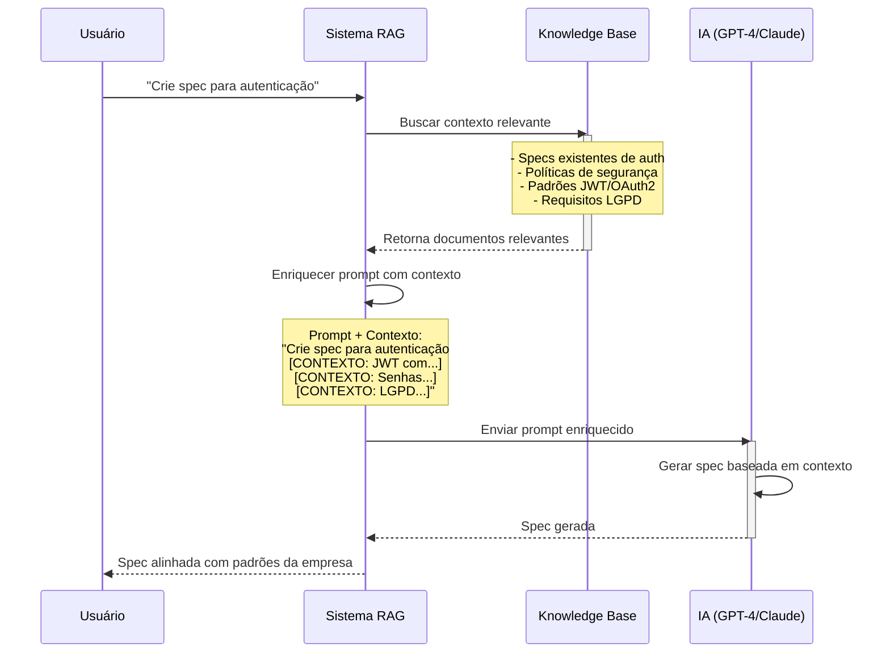
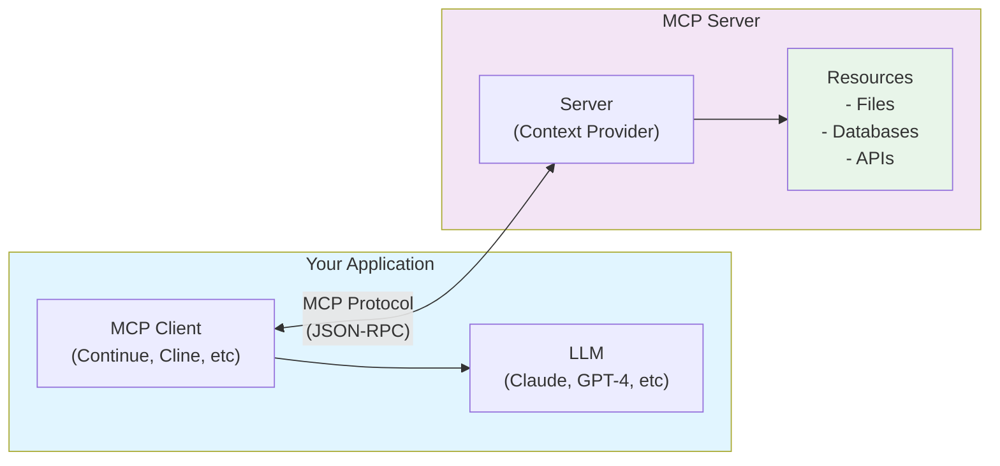

# RAG, MCP e Agents: Potencializando SDD com IA Avançada

## Introdução

Este documento explora três conceitos fundamentais para maximizar o uso de IA em Spec-Driven Development:

- **RAG (Retrieval-Augmented Generation)**: Enriquecer prompts com contexto relevante
- **MCP (Model Context Protocol)**: Protocolo para integração de contexto estruturado
- **Agents**: Sistemas autônomos que executam tarefas complexas

Quando combinados com SDD, esses conceitos criam um ecossistema poderoso para desenvolvimento de software assistido por IA.

---

## RAG (Retrieval-Augmented Generation)

### O que é RAG?

**Retrieval-Augmented Generation** é uma técnica que combina:
1. **Retrieval (Recuperação)**: Buscar informações relevantes em uma base de conhecimento
2. **Augmentation (Aumento)**: Adicionar essas informações ao contexto do modelo
3. **Generation (Geração)**: Gerar resposta baseada no contexto enriquecido

### Por Que RAG é Importante para SDD?

Em SDD, você precisa que a IA entenda:
- Especificações existentes do projeto
- Padrões arquiteturais da empresa
- Histórico de decisões técnicas
- Documentação de APIs internas
- Requisitos de compliance e segurança

**RAG permite que a IA acesse esse conhecimento automaticamente.**

### Como RAG Funciona no Contexto de SDD



### Implementando RAG para SDD

#### Opção 1: RAG Simples com Embeddings

```python
# 1. Indexar documentação existente
from openai import OpenAI
import chromadb

client = OpenAI()
chroma_client = chromadb.Client()

# Criar collection para specs
collection = chroma_client.create_collection("specs")

# Indexar specs existentes
specs = [
    {"id": "auth-spec", "content": "...", "metadata": {"type": "authentication"}},
    {"id": "payment-spec", "content": "...", "metadata": {"type": "payment"}},
]

for spec in specs:
    embedding = client.embeddings.create(
        input=spec["content"],
        model="text-embedding-3-small"
    )
    collection.add(
        ids=[spec["id"]],
        embeddings=[embedding.data[0].embedding],
        documents=[spec["content"]],
        metadatas=[spec["metadata"]]
    )

# 2. Buscar contexto relevante
def get_relevant_context(query: str, n_results: int = 3):
    query_embedding = client.embeddings.create(
        input=query,
        model="text-embedding-3-small"
    )
    
    results = collection.query(
        query_embeddings=[query_embedding.data[0].embedding],
        n_results=n_results
    )
    
    return results["documents"][0]

# 3. Gerar spec com contexto
user_request = "Crie spec para sistema de notificações"
context = get_relevant_context(user_request)

prompt = f"""
Você é um arquiteto de APIs especializado.

CONTEXTO RELEVANTE:
{'\n'.join(context)}

TAREFA:
{user_request}

Gere uma especificação OpenAPI 3.0 que siga os padrões observados no contexto.
"""

response = client.chat.completions.create(
    model="gpt-4",
    messages=[{"role": "user", "content": prompt}]
)
```

#### Opção 2: RAG com Base de Conhecimento Estruturada

```typescript
// Estrutura de conhecimento para SDD
interface KnowledgeBase {
  specs: Spec[];
  architecturalPatterns: Pattern[];
  securityPolicies: Policy[];
  complianceRequirements: Requirement[];
}

// Buscar contexto relevante
async function retrieveContext(query: string): Promise<Context> {
  const vectorStore = new ChromaDB();
  
  // Buscar em múltiplas categorias
  const [specs, patterns, policies] = await Promise.all([
    vectorStore.search('specs', query, { limit: 3 }),
    vectorStore.search('patterns', query, { limit: 2 }),
    vectorStore.search('policies', query, { limit: 2 })
  ]);
  
  return {
    relevantSpecs: specs,
    applicablePatterns: patterns,
    requiredPolicies: policies
  };
}

// Gerar spec com contexto
async function generateSpec(userRequest: string) {
  const context = await retrieveContext(userRequest);
  
  const prompt = `
Gere especificação OpenAPI 3.0 para: ${userRequest}

SPECS SIMILARES EXISTENTES:
${context.relevantSpecs.map(s => s.content).join('\n\n')}

PADRÕES ARQUITETURAIS A SEGUIR:
${context.applicablePatterns.map(p => p.description).join('\n')}

POLÍTICAS OBRIGATÓRIAS:
${context.requiredPolicies.map(p => p.rule).join('\n')}
`;

  return await ai.generate(prompt);
}
```

### Casos de Uso de RAG em SDD

#### 1. Geração de Specs Consistentes
```
Problema: Cada dev cria specs com padrões diferentes
Solução RAG: Busca specs existentes e força consistência
```

#### 2. Compliance Automático
```
Problema: Esquecer requisitos de LGPD/HIPAA/PCI-DSS
Solução RAG: Injeta automaticamente requisitos de compliance no contexto
```

#### 3. Reutilização de Schemas
```
Problema: Duplicação de schemas (User, Address, etc)
Solução RAG: Identifica schemas existentes e sugere reutilização
```

#### 4. Padrões Arquiteturais
```
Problema: Violação de padrões da empresa
Solução RAG: Recupera padrões e valida conformidade
```

---

## MCP (Model Context Protocol)

### O que é MCP?

**Model Context Protocol** é um protocolo aberto criado pela Anthropic para padronizar como aplicações fornecem contexto para modelos de linguagem (LLMs).

### Componentes do MCP



### MCP para SDD: Casos de Uso

#### 1. Servidor MCP para Specs

```typescript
// mcp-server-specs.ts
import { Server } from "@modelcontextprotocol/sdk/server/index.js";
import { StdioServerTransport } from "@modelcontextprotocol/sdk/server/stdio.js";

const server = new Server({
  name: "sdd-specs-server",
  version: "1.0.0",
});

// Expor specs como recursos
server.setRequestHandler("resources/list", async () => {
  return {
    resources: [
      {
        uri: "spec://openapi/auth",
        name: "Authentication API Spec",
        mimeType: "application/yaml"
      },
      {
        uri: "spec://openapi/payments",
        name: "Payments API Spec",
        mimeType: "application/yaml"
      }
    ]
  };
});

// Ler conteúdo de specs
server.setRequestHandler("resources/read", async (request) => {
  const uri = request.params.uri;
  
  if (uri === "spec://openapi/auth") {
    return {
      contents: [{
        uri,
        mimeType: "application/yaml",
        text: await readSpecFile("specs/auth.yaml")
      }]
    };
  }
  
  // ... outros specs
});

// Ferramentas para validar specs
server.setRequestHandler("tools/list", async () => {
  return {
    tools: [{
      name: "validate_spec",
      description: "Valida especificação OpenAPI contra padrões da empresa",
      inputSchema: {
        type: "object",
        properties: {
          spec: { type: "string", description: "Conteúdo da spec YAML" }
        }
      }
    }]
  };
});

server.setRequestHandler("tools/call", async (request) => {
  if (request.params.name === "validate_spec") {
    const spec = request.params.arguments.spec;
    const errors = await validateSpec(spec);
    
    return {
      content: [{
        type: "text",
        text: JSON.stringify(errors, null, 2)
      }]
    };
  }
});

const transport = new StdioServerTransport();
await server.connect(transport);
```

#### 2. Cliente MCP em Workflow SDD

```typescript
// Usar MCP no workflow Spec Kit
import { Client } from "@modelcontextprotocol/sdk/client/index.js";

const client = new Client({
  name: "sdd-workflow",
  version: "1.0.0"
});

// Conectar ao servidor de specs
await client.connect(new StdioClientTransport({
  command: "node",
  args: ["mcp-server-specs.js"]
}));

// Fase 1: Specify - Buscar specs similares
async function specifyPhase(userRequest: string) {
  // Listar specs disponíveis
  const resources = await client.request("resources/list", {});
  
  // Ler specs relevantes
  const authSpec = await client.request("resources/read", {
    uri: "spec://openapi/auth"
  });
  
  // Gerar nova spec com contexto
  const prompt = `
Crie spec para: ${userRequest}

SPECS EXISTENTES PARA REFERÊNCIA:
${authSpec.contents[0].text}
`;
  
  return await ai.generate(prompt);
}

// Fase 2: Plan - Validar contra padrões
async function planPhase(spec: string) {
  const validation = await client.request("tools/call", {
    name: "validate_spec",
    arguments: { spec }
  });
  
  return validation;
}
```

### Benefícios do MCP para SDD

1. **Padronização**: Protocolo único para acessar contexto
2. **Modularidade**: Servidores MCP podem ser desenvolvidos independentemente
3. **Reutilização**: Mesmo servidor MCP funciona com múltiplos LLMs
4. **Segurança**: Controle granular sobre o que a IA pode acessar

---

## Agents (Agentes Autônomos)

### O que são Agents?

**Agents** são sistemas de IA que podem:
1. **Planejar**: Quebrar tarefas complexas em subtarefas
2. **Executar**: Usar ferramentas para realizar ações
3. **Observar**: Analisar resultados e ajustar plano
4. **Iterar**: Repetir até completar objetivo

### Agents vs Prompts Simples

```
┌─────────────────────────────────────────────────────────┐
│ Prompt Simples                                          │
├─────────────────────────────────────────────────────────┤
│ Usuário → Prompt → IA → Resposta → FIM                 │
│                                                          │
│ Limitação: Uma única interação                          │
└─────────────────────────────────────────────────────────┘

┌─────────────────────────────────────────────────────────┐
│ Agent                                                    │
├─────────────────────────────────────────────────────────┤
│ Usuário → Objetivo                                       │
│     ↓                                                    │
│ Agent planeja → Executa → Observa → Ajusta → Repete     │
│     ↓              ↓         ↓         ↓                │
│ Usa ferramentas: Lê arquivos, Roda testes, Valida, etc  │
│     ↓                                                    │
│ Objetivo alcançado → FIM                                 │
└─────────────────────────────────────────────────────────┘
```

### Agent para SDD: Arquitetura

```typescript
interface SDDAgent {
  // Ferramentas disponíveis
  tools: {
    readSpec(path: string): Promise<string>;
    writeSpec(path: string, content: string): Promise<void>;
    validateSpec(spec: string): Promise<ValidationResult>;
    generateCode(spec: string, target: string): Promise<string>;
    runTests(code: string): Promise<TestResult>;
  };
  
  // Loop principal
  async execute(goal: string): Promise<Result>;
}

class SpecDrivenAgent implements SDDAgent {
  async execute(goal: string): Promise<Result> {
    // 1. Planejar
    const plan = await this.plan(goal);
    
    // 2. Executar plano
    for (const step of plan.steps) {
      const result = await this.executeStep(step);
      
      // 3. Observar resultado
      if (!result.success) {
        // 4. Ajustar plano
        plan = await this.replan(plan, result.error);
      }
    }
    
    return { success: true, artifacts: plan.artifacts };
  }
  
  private async plan(goal: string): Promise<Plan> {
    const prompt = `
Objetivo: ${goal}

Ferramentas disponíveis:
- readSpec: Ler especificação existente
- writeSpec: Escrever nova especificação
- validateSpec: Validar spec contra padrões
- generateCode: Gerar código da spec
- runTests: Executar testes

Crie plano passo a passo para alcançar o objetivo.
`;
    
    return await this.llm.generate(prompt);
  }
  
  private async executeStep(step: Step): Promise<StepResult> {
    switch (step.tool) {
      case 'readSpec':
        return await this.tools.readSpec(step.args.path);
      case 'validateSpec':
        return await this.tools.validateSpec(step.args.spec);
      // ... outros tools
    }
  }
}
```

### Agent SDD em Ação: Exemplo Completo

```typescript
// Objetivo: "Adicionar autenticação OAuth2 ao projeto"

const agent = new SpecDrivenAgent();

const result = await agent.execute(
  "Adicionar autenticação OAuth2 ao projeto"
);

// O que o agent faz internamente:

// 1. Planejar
/*
Plan:
  Step 1: Ler spec existente (specs/api.yaml)
  Step 2: Buscar specs de auth similares (RAG)
  Step 3: Gerar nova spec com OAuth2
  Step 4: Validar spec contra padrões
  Step 5: Se válida, gerar código backend
  Step 6: Gerar testes de contrato
  Step 7: Executar testes
  Step 8: Se testes passam, commit
*/

// 2. Executar Step 1
const currentSpec = await agent.tools.readSpec('specs/api.yaml');

// 3. Executar Step 2 (usa RAG)
const similarSpecs = await agent.rag.search('OAuth2 authentication');

// 4. Executar Step 3
const newSpec = await agent.llm.generate(`
Adicione OAuth2 a esta spec:
${currentSpec}

Referências:
${similarSpecs}
`);

// 5. Executar Step 4
const validation = await agent.tools.validateSpec(newSpec);

if (!validation.valid) {
  // 6. Replanejamento
  newSpec = await agent.fixValidationErrors(newSpec, validation.errors);
}

// 7. Executar Step 5
const code = await agent.tools.generateCode(newSpec, 'nodejs');

// 8. Executar Step 6
const tests = await agent.tools.generateTests(newSpec);

// 9. Executar Step 7
const testResults = await agent.tools.runTests(tests);

if (testResults.passed) {
  // 10. Executar Step 8
  await agent.tools.commit({
    spec: newSpec,
    code: code,
    tests: tests,
    message: "feat(auth): add OAuth2 authentication"
  });
}
```

### Frameworks de Agents para SDD

#### 1. LangChain Agents

```python
from langchain.agents import initialize_agent, Tool
from langchain.llms import OpenAI

# Definir ferramentas
tools = [
    Tool(
        name="ReadSpec",
        func=lambda path: read_spec_file(path),
        description="Lê arquivo de especificação OpenAPI"
    ),
    Tool(
        name="ValidateSpec",
        func=lambda spec: validate_openapi(spec),
        description="Valida especificação OpenAPI"
    ),
    Tool(
        name="GenerateCode",
        func=lambda spec: generate_code_from_spec(spec),
        description="Gera código a partir da spec"
    )
]

# Criar agent
llm = OpenAI(temperature=0)
agent = initialize_agent(
    tools,
    llm,
    agent="zero-shot-react-description",
    verbose=True
)

# Executar
result = agent.run(
    "Crie spec OpenAPI para API de tarefas e gere código Node.js"
)
```

#### 2. AutoGPT para SDD

```python
from autogpt import AutoGPT

# Configurar AutoGPT para SDD
agent = AutoGPT(
    name="SpecDrivenAgent",
    role="Especialista em Spec-Driven Development",
    goals=[
        "Criar especificações OpenAPI de alta qualidade",
        "Validar specs contra padrões da empresa",
        "Gerar código que implementa a spec corretamente",
        "Garantir que testes de contrato passam"
    ],
    tools=[
        "read_file",
        "write_file",
        "execute_shell",
        "web_search"
    ]
)

# Executar
agent.run("Implementar API de notificações com SDD")
```

### Agents Multi-Fase para Spec Kit

```typescript
// Agent que implementa workflow Spec Kit completo

class SpecKitAgent {
  async execute(userRequest: string) {
    // Fase 1: Specify
    const spec = await this.specifyAgent.run({
      input: userRequest,
      context: await this.rag.getContext(userRequest)
    });
    
    // Checkpoint: Usuário valida spec
    const specApproved = await this.getUserApproval(spec);
    if (!specApproved) {
      return this.execute(userRequest); // Retry
    }
    
    // Fase 2: Plan
    const plan = await this.planAgent.run({
      spec: spec,
      constraints: await this.getArchitecturalConstraints()
    });
    
    // Checkpoint: Usuário valida plano
    const planApproved = await this.getUserApproval(plan);
    if (!planApproved) {
      return this.planAgent.run({ spec, constraints }); // Retry
    }
    
    // Fase 3: Tasks
    const tasks = await this.tasksAgent.run({
      spec: spec,
      plan: plan
    });
    
    // Fase 4: Implement
    const implementation = await this.implementAgent.run({
      tasks: tasks,
      parallel: true // Implementa tarefas em paralelo quando possível
    });
    
    return {
      spec,
      plan,
      tasks,
      implementation
    };
  }
}
```

---

## Integrando RAG + MCP + Agents em SDD

### Arquitetura Completa

```
┌─────────────────────────────────────────────────────────────┐
│                     SDD com IA Avançada                      │
├─────────────────────────────────────────────────────────────┤
│                                                              │
│  ┌──────────────────────────────────────────────────────┐  │
│  │                    Agent Layer                        │  │
│  │  ┌────────────┐  ┌────────────┐  ┌────────────┐     │  │
│  │  │  Specify   │→ │    Plan    │→ │   Tasks    │     │  │
│  │  │   Agent    │  │   Agent    │  │   Agent    │     │  │
│  │  └────────────┘  └────────────┘  └────────────┘     │  │
│  └──────────────────────────────────────────────────────┘  │
│           ↓                  ↓                  ↓           │
│  ┌──────────────────────────────────────────────────────┐  │
│  │                    MCP Layer                          │  │
│  │  ┌────────────┐  ┌────────────┐  ┌────────────┐     │  │
│  │  │   Specs    │  │  Patterns  │  │  Policies  │     │  │
│  │  │   Server   │  │   Server   │  │   Server   │     │  │
│  │  └────────────┘  └────────────┘  └────────────┘     │  │
│  └──────────────────────────────────────────────────────┘  │
│           ↓                  ↓                  ↓           │
│  ┌──────────────────────────────────────────────────────┐  │
│  │                    RAG Layer                          │  │
│  │  ┌────────────┐  ┌────────────┐  ┌────────────┐     │  │
│  │  │  Vector    │  │  Semantic  │  │  Hybrid    │     │  │
│  │  │   Store    │  │   Search   │  │   Search   │     │  │
│  │  └────────────┘  └────────────┘  └────────────┘     │  │
│  └──────────────────────────────────────────────────────┘  │
│           ↓                  ↓                  ↓           │
│  ┌──────────────────────────────────────────────────────┐  │
│  │                 Knowledge Base                        │  │
│  │  - OpenAPI Specs                                      │  │
│  │  - Architectural Patterns                             │  │
│  │  - Security Policies                                  │  │
│  │  - Compliance Requirements                            │  │
│  │  - Code Examples                                      │  │
│  └──────────────────────────────────────────────────────┘  │
└─────────────────────────────────────────────────────────────┘
```

### Exemplo de Implementação Completa

```typescript
// Sistema completo RAG + MCP + Agents para SDD

class AdvancedSDDSystem {
  private rag: RAGSystem;
  private mcp: MCPClient;
  private agents: {
    specify: Agent;
    plan: Agent;
    tasks: Agent;
    implement: Agent;
  };
  
  async processRequest(userRequest: string): Promise<SDDResult> {
    // 1. RAG: Buscar contexto relevante
    const context = await this.rag.retrieve({
      query: userRequest,
      sources: ['specs', 'patterns', 'policies']
    });
    
    // 2. MCP: Acessar recursos estruturados
    const resources = await this.mcp.getResources({
      types: ['spec', 'pattern', 'policy'],
      relevantTo: userRequest
    });
    
    // 3. Agent: Executar workflow Spec Kit
    const result = await this.agents.specify.run({
      request: userRequest,
      context: context,
      resources: resources
    });
    
    // 4. Validação com MCP tools
    const validation = await this.mcp.callTool('validate_spec', {
      spec: result.spec
    });
    
    if (!validation.valid) {
      // 5. Agent corrige baseado em feedback
      result.spec = await this.agents.specify.fix({
        spec: result.spec,
        errors: validation.errors,
        context: context
      });
    }
    
    return result;
  }
}

// Uso
const sdd = new AdvancedSDDSystem();

const result = await sdd.processRequest(
  "Criar API de pagamentos com suporte a PIX e cartão"
);

console.log(result.spec); // Spec OpenAPI completa
console.log(result.plan); // Plano técnico detalhado
console.log(result.tasks); // Lista de tarefas
```

---

## Melhores Práticas

### 1. RAG

✅ **Faça**:
- Indexe toda documentação relevante (specs, padrões, políticas)
- Use embeddings de qualidade (text-embedding-3-large)
- Implemente busca híbrida (semântica + keyword)
- Mantenha índices atualizados

❌ **Não Faça**:
- Indexar informações desatualizadas
- Usar apenas busca por keywords
- Ignorar metadados importantes

### 2. MCP

✅ **Faça**:
- Crie servidores MCP modulares (um por domínio)
- Exponha apenas recursos necessários
- Implemente controle de acesso
- Documente ferramentas claramente

❌ **Não Faça**:
- Expor dados sensíveis sem controle
- Criar servidores monolíticos
- Ignorar versionamento de protocolo

### 3. Agents

✅ **Faça**:
- Defina objetivos claros
- Forneça ferramentas específicas
- Implemente checkpoints de validação
- Monitore execução

❌ **Não Faça**:
- Dar acesso irrestrito ao sistema
- Confiar cegamente em outputs
- Ignorar custos de API

---

## Recursos Adicionais

### RAG
- **[LangChain RAG](https://python.langchain.com/docs/use_cases/question_answering/)**: Framework para RAG
- **[ChromaDB](https://www.trychroma.com/)**: Vector database
- **[Pinecone](https://www.pinecone.io/)**: Vector database gerenciado

### MCP
- **[Model Context Protocol Spec](https://spec.modelcontextprotocol.io/)**: Especificação oficial
- **[MCP SDK](https://github.com/modelcontextprotocol/sdk)**: SDK TypeScript/Python
- **[MCP Servers](https://github.com/modelcontextprotocol/servers)**: Servidores de exemplo

### Agents
- **[LangChain Agents](https://python.langchain.com/docs/modules/agents/)**: Framework de agents
- **[AutoGPT](https://github.com/Significant-Gravitas/AutoGPT)**: Agent autônomo
- **[CrewAI](https://www.crewai.com/)**: Multi-agent systems

---

## Conclusão

A combinação de **RAG + MCP + Agents** transforma SDD de uma metodologia manual em um processo altamente automatizado:

- **RAG** garante que a IA tenha contexto relevante
- **MCP** padroniza acesso a recursos
- **Agents** executam workflows complexos autonomamente

**Resultado**: Desenvolvimento de software mais rápido, consistente e alinhado com padrões organizacionais.

---

**Próximos Passos**:
1. Implemente RAG básico para suas specs
2. Experimente MCP com Spec Kit
3. Crie agent simples para uma fase do SDD
4. Itere e expanda conforme necessário
