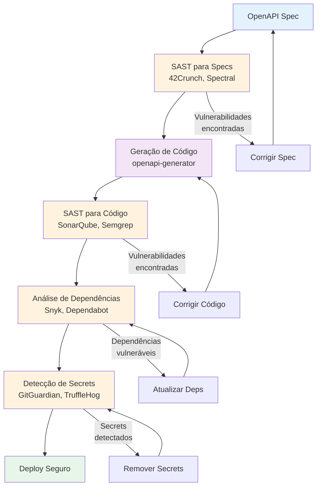

# Ferramentas SAST para Spec-Driven Development

## Introdução

**SAST (Static Application Security Testing)** são ferramentas que analisam código-fonte, bytecode ou binários para identificar vulnerabilidades de segurança **sem executar** o código. No contexto de SDD, SAST desempenha papel crucial em garantir que tanto **specs** quanto **código gerado** sejam seguros.

Este documento cobre:
- Principais ferramentas SAST
- Como integrar SAST em workflow SDD
- Análise de specs (OpenAPI, AsyncAPI)
- Análise de código gerado
- CI/CD com SAST

---

## Por Que SAST é Crítico para SDD?

### Problema: Segurança em Specs

```yaml
# specs/api.yaml - Spec INSEGURA
paths:
  /users/{id}:
    get:
      parameters:
        - name: id
          in: path
          schema:
            type: string  # ❌ Sem validação! SQL Injection possível
      security: []  # ❌ Endpoint público sem autenticação!
```

### Problema: Código Gerado Inseguro

```typescript
// Gerado automaticamente da spec
app.get('/users/:id', (req, res) => {
  // ❌ SQL Injection vulnerability
  const query = `SELECT * FROM users WHERE id = ${req.params.id}`;
  db.query(query, (err, result) => {
    res.json(result);
  });
});
```

### Solução: SAST em Múltiplas Camadas



---

## Principais Ferramentas SAST

### 1. Para Análise de Specs (OpenAPI/AsyncAPI)

#### 42Crunch Security Audit

**O que é**: Ferramenta especializada em segurança de APIs OpenAPI.

**Características**:
- ✅ Análise de segurança de specs OpenAPI 3.0/3.1
- ✅ 200+ verificações de segurança
- ✅ Scores de segurança (A-F)
- ✅ Sugestões de correção

**Instalação**:
```bash
npm install -g @42crunch/api-security-audit
```

**Uso Básico**:
```bash
# Auditar spec
audit-api specs/api.yaml

# Output JSON
audit-api specs/api.yaml --format json > audit-report.json
```

**Exemplo de Saída**:
```json
{
  "score": 65,
  "grade": "C",
  "issues": [
    {
      "severity": "high",
      "issue": "No authentication required",
      "path": "/users/{id}",
      "suggestion": "Add security requirement"
    },
    {
      "severity": "medium",
      "issue": "Missing input validation",
      "path": "/users/{id}/parameters/id",
      "suggestion": "Add pattern or format validation"
    }
  ]
}
```

**Integração CI/CD**:
```yaml
# .github/workflows/security.yml
name: API Security Audit

on: [push, pull_request]

jobs:
  audit:
    runs-on: ubuntu-latest
    steps:
      - uses: actions/checkout@v3
      
      - name: Install 42Crunch
        run: npm install -g @42crunch/api-security-audit
      
      - name: Audit API Specs
        run: |
          for spec in specs/*.yaml; do
            audit-api "$spec" --min-score 75 || exit 1
          done
```

**Preço**: Gratuito (CLI), Pago (plataforma completa)

---

#### Spectral (com Regras de Segurança)

**O que é**: Linter de specs OpenAPI/AsyncAPI com suporte a regras customizadas.

**Características**:
- ✅ Linting de OpenAPI, AsyncAPI, JSON Schema
- ✅ Regras customizáveis
- ✅ Rulesets prontos (OWASP, etc)

**Instalação**:
```bash
npm install -g @stoplight/spectral-cli
```

**Configuração com Segurança**:
```yaml
# .spectral.yaml
extends:
  - spectral:oas
  - spectral:asyncapi
  
rules:
  # Segurança: Autenticação obrigatória
  no-public-endpoints:
    description: Endpoints devem ter autenticação
    severity: error
    given: $.paths.*[get,post,put,patch,delete]
    then:
      field: security
      function: truthy
  
  # Segurança: Validação de parâmetros
  parameter-validation:
    description: Parâmetros devem ter validação
    severity: warn
    given: $.paths..parameters[*]
    then:
      field: schema
      function: schema
      functionOptions:
        schema:
          required: [type]
          properties:
            type:
              enum: [string, number, integer, boolean, array, object]
  
  # Segurança: Rate limiting
  rate-limiting-header:
    description: Endpoints devem documentar rate limiting
    severity: warn
    given: $.paths.*[get,post,put,patch,delete].responses.429
    then:
      function: truthy
  
  # Segurança: HTTPS obrigatório
  https-only:
    description: Servers devem usar HTTPS
    severity: error
    given: $.servers[*].url
    then:
      function: pattern
      functionOptions:
        match: "^https://"
```

**Uso**:
```bash
spectral lint specs/api.yaml
```

**Preço**: Gratuito (open source)

---

### 2. Para Análise de Código

#### SonarQube / SonarCloud

**O que é**: Plataforma de análise de código com foco em qualidade e segurança.

**Características**:
- ✅ Suporta 25+ linguagens
- ✅ Detecta vulnerabilidades OWASP Top 10
- ✅ Code smells e bugs
- ✅ Cobertura de testes

**Instalação (SonarCloud)**:
```bash
# Via GitHub Actions
# Não requer instalação local
```

**Configuração**:
```yaml
# .github/workflows/sonar.yml
name: SonarCloud Analysis

on:
  push:
    branches: [main]
  pull_request:
    branches: [main]

jobs:
  sonarcloud:
    runs-on: ubuntu-latest
    steps:
      - uses: actions/checkout@v3
        with:
          fetch-depth: 0
      
      - name: SonarCloud Scan
        uses: SonarSource/sonarcloud-github-action@master
        env:
          GITHUB_TOKEN: ${{ secrets.GITHUB_TOKEN }}
          SONAR_TOKEN: ${{ secrets.SONAR_TOKEN }}
```

**Configuração do Projeto**:
```properties
# sonar-project.properties
sonar.projectKey=my-sdd-project
sonar.organization=my-org

sonar.sources=src
sonar.tests=tests
sonar.exclusions=**/node_modules/**,**/generated/**

# Cobertura
sonar.javascript.lcov.reportPaths=coverage/lcov.info

# Limites de qualidade
sonar.qualitygate.wait=true
```

**Vulnerabilidades Detectadas**:
- SQL Injection
- XSS (Cross-Site Scripting)
- CSRF
- Hardcoded secrets
- Weak cryptography
- Path traversal
- Command injection

**Preço**: 
- SonarQube Community: Gratuito (self-hosted)
- SonarCloud: Gratuito (projetos públicos), Pago (privados)

---

#### Semgrep

**O que é**: SAST rápido e customizável com regras em YAML.

**Características**:
- ✅ Extremamente rápido
- ✅ Regras customizáveis em YAML
- ✅ Suporta 30+ linguagens
- ✅ Rulesets prontos (OWASP, CWE)

**Instalação**:
```bash
pip install semgrep
# ou
brew install semgrep
```

**Uso Básico**:
```bash
# Scan com regras padrão
semgrep --config=auto src/

# Scan com regras OWASP
semgrep --config=p/owasp-top-ten src/

# Scan com regras customizadas
semgrep --config=.semgrep.yml src/
```

**Regras Customizadas para SDD**:
```yaml
# .semgrep.yml
rules:
  - id: sql-injection-risk
    pattern: |
      db.query($QUERY)
    message: Possível SQL Injection. Use queries parametrizadas.
    severity: ERROR
    languages: [javascript, typescript]
    
  - id: hardcoded-secret
    pattern-either:
      - pattern: |
          const $VAR = "$SECRET"
      - pattern: |
          apiKey: "$KEY"
    message: Secret hardcoded detectado
    severity: ERROR
    languages: [javascript, typescript]
    
  - id: missing-auth-middleware
    pattern: |
      app.$METHOD($PATH, $HANDLER)
    pattern-not: |
      app.$METHOD($PATH, authenticate, $HANDLER)
    message: Endpoint sem middleware de autenticação
    severity: WARNING
    languages: [javascript, typescript]
```

**Integração CI/CD**:
```yaml
# .github/workflows/semgrep.yml
name: Semgrep

on: [push, pull_request]

jobs:
  semgrep:
    runs-on: ubuntu-latest
    steps:
      - uses: actions/checkout@v3
      
      - name: Run Semgrep
        uses: returntocorp/semgrep-action@v1
        with:
          config: >-
            p/security-audit
            p/owasp-top-ten
            .semgrep.yml
```

**Preço**: Gratuito (open source), Pago (Semgrep Cloud com features avançadas)

---

#### Snyk Code

**O que é**: SAST focado em segurança, integrado com Snyk (SCA).

**Características**:
- ✅ Análise de código em tempo real (IDE)
- ✅ Fix suggestions automáticos
- ✅ Integração com Snyk Open Source (SCA)
- ✅ Suporta 10+ linguagens

**Instalação**:
```bash
npm install -g snyk
snyk auth
```

**Uso**:
```bash
# Scan de código
snyk code test

# Scan de dependências (SCA)
snyk test

# Scan de containers
snyk container test node:18
```

**Integração VS Code**:
```bash
code --install-extension snyk-security.snyk-vulnerability-scanner
```

**Integração CI/CD**:
```yaml
# .github/workflows/snyk.yml
name: Snyk Security

on: [push, pull_request]

jobs:
  security:
    runs-on: ubuntu-latest
    steps:
      - uses: actions/checkout@v3
      
      - name: Run Snyk Code
        uses: snyk/actions/node@master
        env:
          SNYK_TOKEN: ${{ secrets.SNYK_TOKEN }}
        with:
          command: code test
      
      - name: Run Snyk Open Source
        uses: snyk/actions/node@master
        env:
          SNYK_TOKEN: ${{ secrets.SNYK_TOKEN }}
        with:
          command: test
```

**Preço**: Gratuito (limitado), Pago (ilimitado + features avançadas)

---

#### CodeQL (GitHub Advanced Security)

**O que é**: SAST do GitHub, integrado nativamente ao GitHub.

**Características**:
- ✅ Integração nativa com GitHub
- ✅ Queries customizáveis
- ✅ Suporta 10+ linguagens
- ✅ Gratuito para repositórios públicos

**Configuração**:
```yaml
# .github/workflows/codeql.yml
name: CodeQL

on:
  push:
    branches: [main]
  pull_request:
    branches: [main]
  schedule:
    - cron: '0 0 * * 1'  # Toda segunda-feira

jobs:
  analyze:
    runs-on: ubuntu-latest
    permissions:
      security-events: write
    
    strategy:
      matrix:
        language: [javascript, typescript]
    
    steps:
      - uses: actions/checkout@v3
      
      - name: Initialize CodeQL
        uses: github/codeql-action/init@v2
        with:
          languages: ${{ matrix.language }}
      
      - name: Autobuild
        uses: github/codeql-action/autobuild@v2
      
      - name: Perform CodeQL Analysis
        uses: github/codeql-action/analyze@v2
```

**Queries Customizadas**:
```ql
// .github/codeql/custom-queries.ql
import javascript

from CallExpr call
where call.getCalleeName() = "eval"
select call, "Uso de eval() detectado - risco de segurança"
```

**Preço**: 
- Gratuito (repositórios públicos)
- Pago (GitHub Advanced Security para privados)

---

### 3. Para Análise de Dependências (SCA)

#### Snyk Open Source

**Uso**:
```bash
snyk test
snyk monitor  # Monitoramento contínuo
```

#### Dependabot (GitHub)

**Configuração**:
```yaml
# .github/dependabot.yml
version: 2
updates:
  - package-ecosystem: npm
    directory: "/"
    schedule:
      interval: weekly
    open-pull-requests-limit: 10
    
    # Alertas de segurança
    security-updates-only: true
```

#### npm audit / yarn audit

**Uso**:
```bash
npm audit
npm audit fix

yarn audit
yarn audit fix
```

---

### 4. Para Detecção de Secrets

#### GitGuardian

**O que é**: Detecta secrets em código, commits e PRs.

**Integração GitHub**:
```yaml
# .github/workflows/gitguardian.yml
name: GitGuardian

on: [push, pull_request]

jobs:
  scanning:
    runs-on: ubuntu-latest
    steps:
      - uses: actions/checkout@v3
        with:
          fetch-depth: 0
      
      - name: GitGuardian scan
        uses: GitGuardian/ggshield-action@v1
        env:
          GITGUARDIAN_API_KEY: ${{ secrets.GITGUARDIAN_API_KEY }}
```

**Preço**: Gratuito (limitado), Pago (ilimitado)

---

#### TruffleHog

**O que é**: Busca secrets em histórico Git.

**Instalação**:
```bash
pip install truffleHog
```

**Uso**:
```bash
# Scan do repositório
trufflehog git https://github.com/user/repo

# Scan local
trufflehog filesystem ./
```

**Integração CI/CD**:
```yaml
# .github/workflows/trufflehog.yml
name: TruffleHog

on: [push, pull_request]

jobs:
  scan:
    runs-on: ubuntu-latest
    steps:
      - uses: actions/checkout@v3
        with:
          fetch-depth: 0
      
      - name: TruffleHog Scan
        uses: trufflesecurity/trufflehog@main
        with:
          path: ./
          base: ${{ github.event.repository.default_branch }}
          head: HEAD
```

**Preço**: Gratuito (open source)

---

## Workflow SAST Completo para SDD

### Pipeline de Segurança em 4 Camadas

```yaml
# .github/workflows/security-full.yml
name: Security Pipeline

on:
  push:
    branches: [main, develop]
  pull_request:
    branches: [main]

jobs:
  # Layer 1: Spec Security
  spec-security:
    runs-on: ubuntu-latest
    steps:
      - uses: actions/checkout@v3
      
      - name: Install 42Crunch
        run: npm install -g @42crunch/api-security-audit
      
      - name: Audit OpenAPI Specs
        run: |
          for spec in specs/*.yaml; do
            echo "Auditing $spec..."
            audit-api "$spec" --min-score 75 || exit 1
          done
      
      - name: Spectral Linting
        run: |
          npm install -g @stoplight/spectral-cli
          spectral lint specs/*.yaml
  
  # Layer 2: Code Security (SAST)
  code-security:
    runs-on: ubuntu-latest
    needs: spec-security
    steps:
      - uses: actions/checkout@v3
      
      - name: Semgrep Scan
        uses: returntocorp/semgrep-action@v1
        with:
          config: >-
            p/security-audit
            p/owasp-top-ten
            .semgrep.yml
      
      - name: SonarCloud Scan
        uses: SonarSource/sonarcloud-github-action@master
        env:
          GITHUB_TOKEN: ${{ secrets.GITHUB_TOKEN }}
          SONAR_TOKEN: ${{ secrets.SONAR_TOKEN }}
      
      - name: Snyk Code Test
        uses: snyk/actions/node@master
        env:
          SNYK_TOKEN: ${{ secrets.SNYK_TOKEN }}
        with:
          command: code test
  
  # Layer 3: Dependency Security (SCA)
  dependency-security:
    runs-on: ubuntu-latest
    needs: code-security
    steps:
      - uses: actions/checkout@v3
      
      - name: npm audit
        run: npm audit --audit-level=moderate
      
      - name: Snyk Open Source Test
        uses: snyk/actions/node@master
        env:
          SNYK_TOKEN: ${{ secrets.SNYK_TOKEN }}
        with:
          command: test
  
  # Layer 4: Secret Detection
  secret-detection:
    runs-on: ubuntu-latest
    steps:
      - uses: actions/checkout@v3
        with:
          fetch-depth: 0
      
      - name: GitGuardian Scan
        uses: GitGuardian/ggshield-action@v1
        env:
          GITGUARDIAN_API_KEY: ${{ secrets.GITGUARDIAN_API_KEY }}
      
      - name: TruffleHog Scan
        uses: trufflesecurity/trufflehog@main
        with:
          path: ./
          base: ${{ github.event.repository.default_branch }}
          head: HEAD
```

---

## Comparação de Ferramentas SAST

| Ferramenta | Tipo | Linguagens | Preço | Melhor Para |
|------------|------|------------|-------|-------------|
| **42Crunch** | Spec | OpenAPI | Gratuito/Pago | Segurança de APIs |
| **Spectral** | Spec | OpenAPI, AsyncAPI | Gratuito | Linting + Segurança |
| **SonarQube** | Code | 25+ | Gratuito/Pago | Qualidade + Segurança |
| **Semgrep** | Code | 30+ | Gratuito/Pago | Regras customizadas |
| **Snyk Code** | Code | 10+ | Gratuito/Pago | Fix suggestions |
| **CodeQL** | Code | 10+ | Gratuito/Pago | GitHub integration |
| **GitGuardian** | Secrets | Todos | Gratuito/Pago | Detecção de secrets |
| **TruffleHog** | Secrets | Todos | Gratuito | Histórico Git |

---

## Boas Práticas SAST para SDD

### 1. Shift-Left Security

```
Tradicional:
Design → Code → Test → Security ← Vulnerabilidades descobertas tarde

SDD com SAST:
Spec (SAST) → Code (SAST) → Test → Deploy
  ↑                ↑
  Vulnerabilidades descobertas cedo
```

### 2. Múltiplas Camadas

```
✅ Não confie em uma única ferramenta
✅ Combine: Spec SAST + Code SAST + SCA + Secret Detection
✅ Cada ferramenta tem pontos fortes diferentes
```

### 3. Automatização Completa

```
✅ SAST em CI/CD (obrigatório)
✅ SAST em pre-commit hooks (opcional)
✅ SAST em IDE (recomendado)
```

### 4. Quality Gates

```yaml
# sonar-project.properties
sonar.qualitygate.wait=true

# Definir limites
sonar.coverage.minimum=80
sonar.security.rating.minimum=A
sonar.bugs.new.maximum=0
```

### 5. False Positives

```
✅ Revisar e marcar false positives
✅ Ajustar regras para reduzir ruído
✅ Não desabilitar regras sem justificativa
```

---

## Integração SAST com Workflow SDD

### Fase 1: Specify (Criar Spec)

```bash
# 1. Criar spec
vim specs/payments.yaml

# 2. Validar segurança da spec
audit-api specs/payments.yaml
spectral lint specs/payments.yaml

# 3. Corrigir issues antes de prosseguir
```

### Fase 2: Plan (Plano Técnico)

```markdown
# Plano deve incluir:
- Ferramentas SAST a usar
- Quality gates mínimos
- Responsável por revisar alertas SAST
```

### Fase 3: Tasks (Implementação)

```bash
# Durante implementação
# 1. SAST em tempo real (IDE)
code --install-extension snyk-security.snyk-vulnerability-scanner

# 2. SAST antes de commit
git add .
semgrep --config=auto src/  # Pre-commit hook
git commit -m "feat: add payment endpoint"
```

### Fase 4: Implement (Deploy)

```bash
# CI/CD executa SAST automaticamente
# Deploy bloqueado se SAST falhar
```

---

## Recursos Adicionais

### Documentação Oficial
- **[42Crunch](https://docs.42crunch.com/)**: Docs completos
- **[Spectral](https://meta.stoplight.io/docs/spectral/)**: Guia de regras
- **[SonarQube](https://docs.sonarqube.org/)**: Documentação
- **[Semgrep](https://semgrep.dev/docs/)**: Guia completo
- **[Snyk](https://docs.snyk.io/)**: Docs Snyk
- **[CodeQL](https://codeql.github.com/docs/)**: Queries e docs

### Rulesets Prontos
- **[Semgrep Registry](https://semgrep.dev/r)**: 2000+ regras
- **[Spectral Rulesets](https://github.com/stoplightio/spectral-rulesets)**: Rulesets OpenAPI
- **[OWASP Top 10](https://owasp.org/www-project-top-ten/)**: Vulnerabilidades mais comuns

---

## Conclusão

**SAST é essencial para SDD seguro**:

1. **Specs**: 42Crunch + Spectral
2. **Código**: SonarQube/Semgrep/Snyk Code
3. **Dependências**: Snyk/Dependabot/npm audit
4. **Secrets**: GitGuardian/TruffleHog

**Workflow Ideal**:
```
Spec → SAST Spec → Code → SAST Code → SCA → Secret Detection → Deploy
```

**Lembre-se**: SAST não substitui testes de segurança dinâmicos (DAST) e penetration testing, mas é a **primeira linha de defesa** e a mais barata de implementar.
